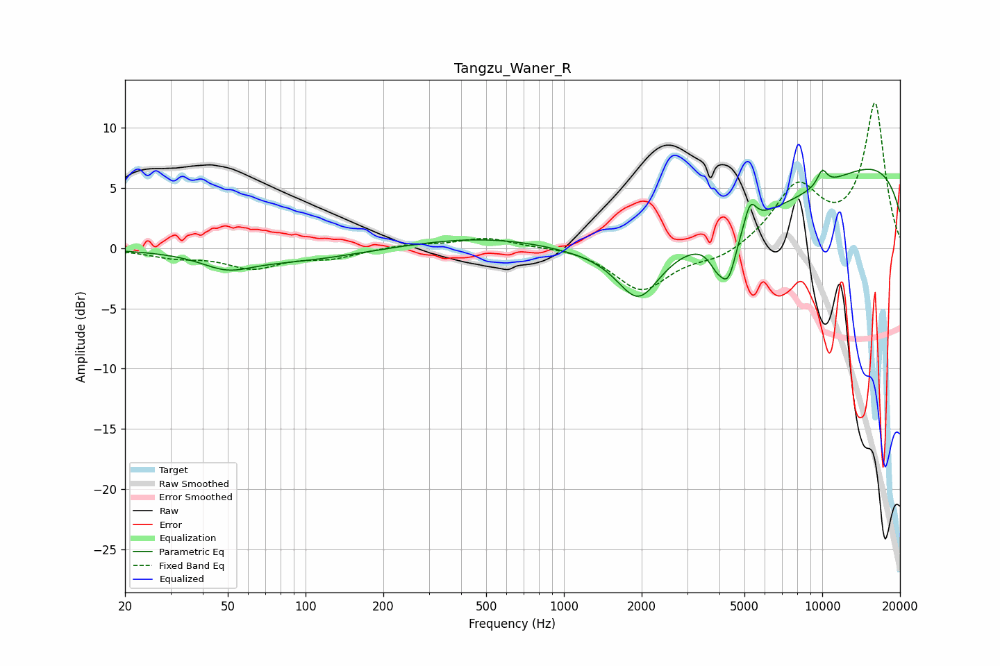

# Tangzu_Waner_R
See [usage instructions](https://github.com/jaakkopasanen/AutoEq#usage) for more options and info.

### Parametric EQs
Apply preamp of -6.7 dB when using parametric equalizer.

|   # | Type    |   Fc (Hz) |    Q |   Gain (dB) |
|-----|---------|-----------|------|-------------|
|   1 | Peaking |        50 | 1.46 |        -1.2 |
|   2 | Peaking |        91 | 0.56 |        -1   |
|   3 | Peaking |      1000 | 0.35 |         3.4 |
|   4 | Peaking |      1944 | 1.74 |        -4.2 |
|   5 | Peaking |      3783 | 0.2  |        -7.4 |
|   6 | Peaking |      3900 | 4.31 |        -1.6 |
|   7 | Peaking |      4333 | 4.33 |        -3.6 |
|   8 | Peaking |      5263 | 5.98 |         2   |
|   9 | Peaking |     10000 | 6    |         1.3 |
|  10 | Peaking |     10000 | 0.2  |        10.6 |

### Fixed Band EQs
When using fixed band (also called graphic) equalizer, apply preamp of **-12.2 dB** (if available) and set gains manually with these parameters.

|   # | Type    |   Fc (Hz) |    Q |   Gain (dB) |
|-----|---------|-----------|------|-------------|
|   1 | Peaking |        31 | 1.41 |        -0.6 |
|   2 | Peaking |        62 | 1.41 |        -1.5 |
|   3 | Peaking |       125 | 1.41 |        -0.7 |
|   4 | Peaking |       250 | 1.41 |         0.3 |
|   5 | Peaking |       500 | 1.41 |         0.9 |
|   6 | Peaking |      1000 | 1.41 |         0.2 |
|   7 | Peaking |      2000 | 1.41 |        -3.5 |
|   8 | Peaking |      4000 | 1.41 |        -0.9 |
|   9 | Peaking |      8000 | 1.41 |         4.9 |
|  10 | Peaking |     16000 | 1.41 |        11.9 |

### Graphs

