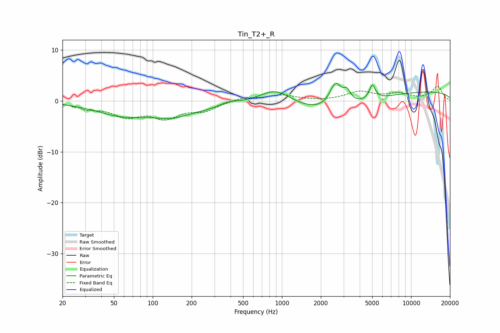

# Tin_T2+_R
See [usage instructions](https://github.com/jaakkopasanen/AutoEq#usage) for more options and info.

### Parametric EQs
Apply preamp of -3.5 dB when using parametric equalizer.

|   # | Type    |   Fc (Hz) |    Q |   Gain (dB) |
|-----|---------|-----------|------|-------------|
|   1 | Peaking |        54 | 0.91 |        -1.1 |
|   2 | Peaking |       119 | 0.34 |        -2.7 |
|   3 | Peaking |       141 | 1.78 |        -0.6 |
|   4 | Peaking |       388 | 1.66 |         0.9 |
|   5 | Peaking |       895 | 1.1  |         3.3 |
|   6 | Peaking |      2310 | 0.47 |        -3.3 |
|   7 | Peaking |      2598 | 3.16 |         4.7 |
|   8 | Peaking |      3189 | 4.96 |         2.2 |
|   9 | Peaking |      5007 | 6    |         2.8 |
|  10 | Peaking |      9663 | 0.18 |         2   |

### Fixed Band EQs
When using fixed band (also called graphic) equalizer, apply preamp of **-3.0 dB** (if available) and set gains manually with these parameters.

|   # | Type    |   Fc (Hz) |    Q |   Gain (dB) |
|-----|---------|-----------|------|-------------|
|   1 | Peaking |        31 | 1.41 |        -1.3 |
|   2 | Peaking |        62 | 1.41 |        -2.7 |
|   3 | Peaking |       125 | 1.41 |        -3   |
|   4 | Peaking |       250 | 1.41 |        -1.7 |
|   5 | Peaking |       500 | 1.41 |         0.7 |
|   6 | Peaking |      1000 | 1.41 |         1.1 |
|   7 | Peaking |      2000 | 1.41 |        -0.1 |
|   8 | Peaking |      4000 | 1.41 |         1.7 |
|   9 | Peaking |      8000 | 1.41 |         1.3 |
|  10 | Peaking |     16000 | 1.41 |         2.8 |

### Graphs

