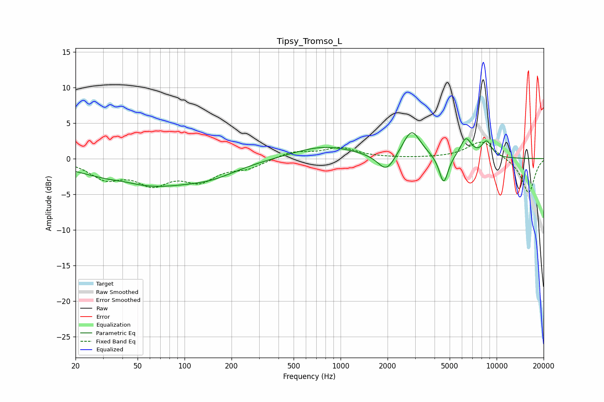

# Tipsy_Tromso_L
See [usage instructions](https://github.com/jaakkopasanen/AutoEq#usage) for more options and info.

### Parametric EQs
Apply preamp of -3.7 dB when using parametric equalizer.

|   # | Type    |   Fc (Hz) |    Q |   Gain (dB) |
|-----|---------|-----------|------|-------------|
|   1 | Peaking |        42 | 1.51 |         0.4 |
|   2 | Peaking |        56 | 0.42 |        -3.8 |
|   3 | Peaking |       152 | 0.86 |        -1.2 |
|   4 | Peaking |       784 | 0.71 |         1.8 |
|   5 | Peaking |      1966 | 2.6  |        -2.5 |
|   6 | Peaking |      2851 | 2.48 |         4   |
|   7 | Peaking |      4580 | 4.9  |        -4   |
|   8 | Peaking |      6356 | 3.8  |         2.7 |
|   9 | Peaking |      8538 | 4.22 |         1.6 |
|  10 | Peaking |      8894 | 4.37 |         0.7 |

### Fixed Band EQs
When using fixed band (also called graphic) equalizer, apply preamp of **-2.4 dB** (if available) and set gains manually with these parameters.

|   # | Type    |   Fc (Hz) |    Q |   Gain (dB) |
|-----|---------|-----------|------|-------------|
|   1 | Peaking |        31 | 1.41 |        -2.5 |
|   2 | Peaking |        62 | 1.41 |        -3.1 |
|   3 | Peaking |       125 | 1.41 |        -2.7 |
|   4 | Peaking |       250 | 1.41 |        -1.2 |
|   5 | Peaking |       500 | 1.41 |         1   |
|   6 | Peaking |      1000 | 1.41 |         1.4 |
|   7 | Peaking |      2000 | 1.41 |         0   |
|   8 | Peaking |      4000 | 1.41 |         0   |
|   9 | Peaking |      8000 | 1.41 |         2.5 |
|  10 | Peaking |     16000 | 1.41 |        -4.9 |

### Graphs

