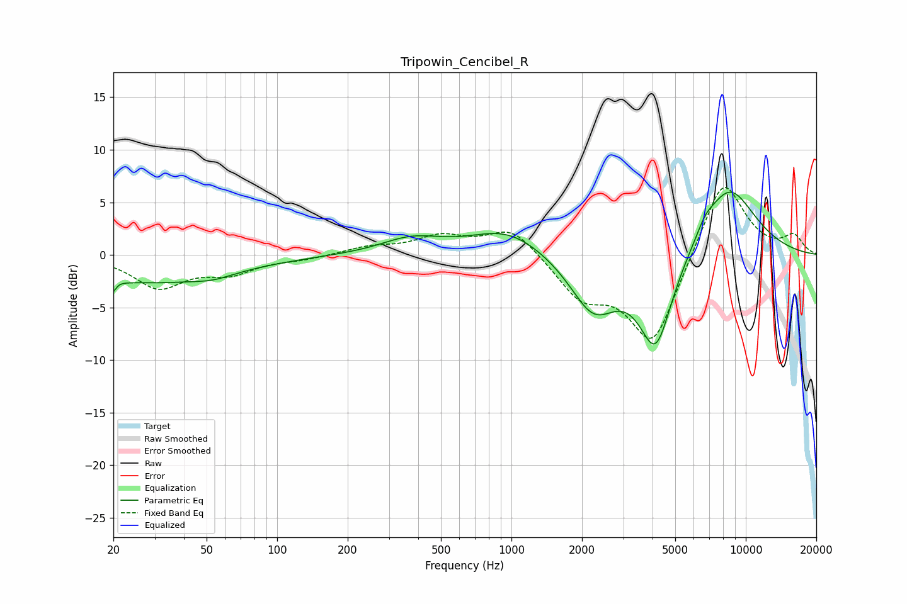

# Tripowin_Cencibel_R
See [usage instructions](https://github.com/jaakkopasanen/AutoEq#usage) for more options and info.

### Parametric EQs
Apply preamp of -6.1 dB when using parametric equalizer.

|   # | Type    |   Fc (Hz) |    Q |   Gain (dB) |
|-----|---------|-----------|------|-------------|
|   1 | Peaking |        20 | 5.94 |        -2.7 |
|   2 | Peaking |        20 | 6    |         1.7 |
|   3 | Peaking |        29 | 0.42 |        -2.5 |
|   4 | Peaking |        53 | 1.69 |        -0.5 |
|   5 | Peaking |       374 | 1.1  |         1.4 |
|   6 | Peaking |       963 | 0.9  |         2.5 |
|   7 | Peaking |      2241 | 1.39 |        -5.3 |
|   8 | Peaking |      4126 | 1.91 |        -8.9 |
|   9 | Peaking |      6696 | 3.86 |         0.8 |
|  10 | Peaking |      8430 | 1.07 |         6.7 |

### Fixed Band EQs
When using fixed band (also called graphic) equalizer, apply preamp of **-6.5 dB** (if available) and set gains manually with these parameters.

|   # | Type    |   Fc (Hz) |    Q |   Gain (dB) |
|-----|---------|-----------|------|-------------|
|   1 | Peaking |        31 | 1.41 |        -3   |
|   2 | Peaking |        62 | 1.41 |        -1.5 |
|   3 | Peaking |       125 | 1.41 |        -0.4 |
|   4 | Peaking |       250 | 1.41 |         0.7 |
|   5 | Peaking |       500 | 1.41 |         1.6 |
|   6 | Peaking |      1000 | 1.41 |         2.7 |
|   7 | Peaking |      2000 | 1.41 |        -3.7 |
|   8 | Peaking |      4000 | 1.41 |        -8.5 |
|   9 | Peaking |      8000 | 1.41 |         7.7 |
|  10 | Peaking |     16000 | 1.41 |         1.7 |

### Graphs

