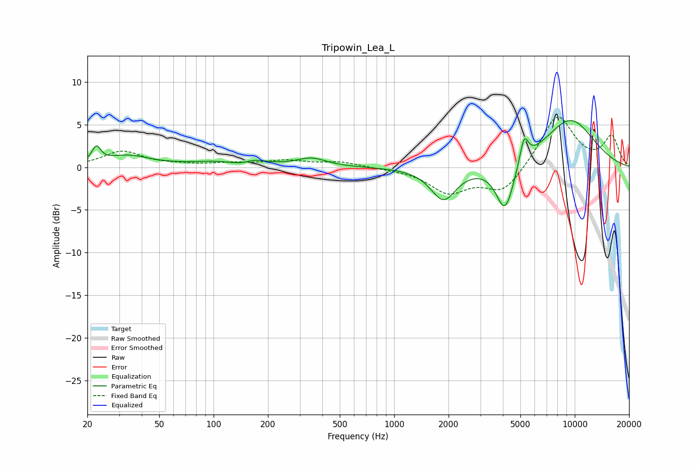

# Tripowin_Lea_L
See [usage instructions](https://github.com/jaakkopasanen/AutoEq#usage) for more options and info.

### Parametric EQs
Apply preamp of -5.6 dB when using parametric equalizer.

|   # | Type    |   Fc (Hz) |    Q |   Gain (dB) |
|-----|---------|-----------|------|-------------|
|   1 | Peaking |        22 | 5.99 |         1.8 |
|   2 | Peaking |        33 | 1.17 |         1.3 |
|   3 | Peaking |       112 | 0.83 |         0.6 |
|   4 | Peaking |       145 | 2    |        -0.6 |
|   5 | Peaking |       165 | 2.18 |         0.7 |
|   6 | Peaking |       348 | 1.73 |         1   |
|   7 | Peaking |      1877 | 2.01 |        -3.8 |
|   8 | Peaking |      4111 | 2.81 |        -5.7 |
|   9 | Peaking |      5241 | 5.84 |         3.1 |
|  10 | Peaking |      9412 | 0.85 |         5.6 |

### Fixed Band EQs
When using fixed band (also called graphic) equalizer, apply preamp of **-6.0 dB** (if available) and set gains manually with these parameters.

|   # | Type    |   Fc (Hz) |    Q |   Gain (dB) |
|-----|---------|-----------|------|-------------|
|   1 | Peaking |        31 | 1.41 |         1.8 |
|   2 | Peaking |        62 | 1.41 |         0.2 |
|   3 | Peaking |       125 | 1.41 |         0.4 |
|   4 | Peaking |       250 | 1.41 |         0.7 |
|   5 | Peaking |       500 | 1.41 |         0.6 |
|   6 | Peaking |      1000 | 1.41 |        -0.1 |
|   7 | Peaking |      2000 | 1.41 |        -2.8 |
|   8 | Peaking |      4000 | 1.41 |        -3   |
|   9 | Peaking |      8000 | 1.41 |         6.2 |
|  10 | Peaking |     16000 | 1.41 |         3.5 |

### Graphs

