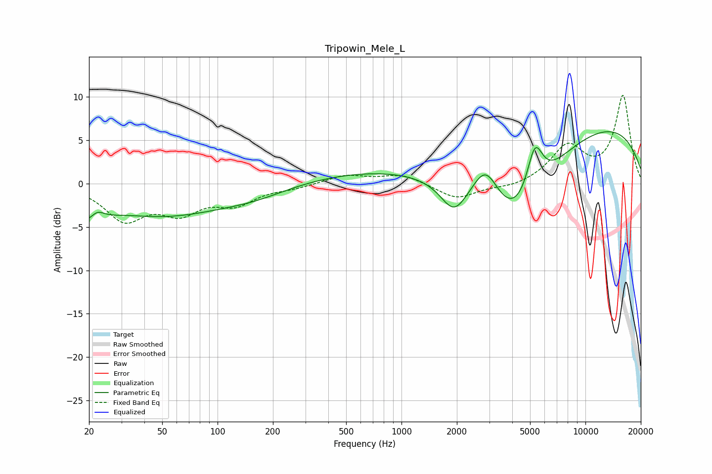

# Tripowin_Mele_L
See [usage instructions](https://github.com/jaakkopasanen/AutoEq#usage) for more options and info.

### Parametric EQs
Apply preamp of -6.1 dB when using parametric equalizer.

|   # | Type    |   Fc (Hz) |    Q |   Gain (dB) |
|-----|---------|-----------|------|-------------|
|   1 | Peaking |        20 | 1.83 |        -3.3 |
|   2 | Peaking |        22 | 3.34 |         1.9 |
|   3 | Peaking |        51 | 0.41 |        -3.5 |
|   4 | Peaking |       161 | 0.78 |        -0.9 |
|   5 | Peaking |      1656 | 0.19 |         2   |
|   6 | Peaking |      1928 | 1.96 |        -3.6 |
|   7 | Peaking |      2872 | 2    |         4.1 |
|   8 | Peaking |      4215 | 0.66 |       -11.1 |
|   9 | Peaking |      5307 | 3.1  |         5.7 |
|  10 | Peaking |      9953 | 0.24 |         7.5 |

### Fixed Band EQs
When using fixed band (also called graphic) equalizer, apply preamp of **-10.3 dB** (if available) and set gains manually with these parameters.

|   # | Type    |   Fc (Hz) |    Q |   Gain (dB) |
|-----|---------|-----------|------|-------------|
|   1 | Peaking |        31 | 1.41 |        -3.9 |
|   2 | Peaking |        62 | 1.41 |        -2.9 |
|   3 | Peaking |       125 | 1.41 |        -2.1 |
|   4 | Peaking |       250 | 1.41 |        -0.4 |
|   5 | Peaking |       500 | 1.41 |         1   |
|   6 | Peaking |      1000 | 1.41 |         1.1 |
|   7 | Peaking |      2000 | 1.41 |        -1.8 |
|   8 | Peaking |      4000 | 1.41 |        -0.5 |
|   9 | Peaking |      8000 | 1.41 |         4.2 |
|  10 | Peaking |     16000 | 1.41 |        10.1 |

### Graphs

