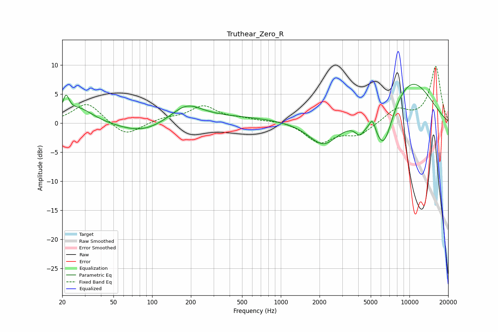

# Truthear_Zero_R
See [usage instructions](https://github.com/jaakkopasanen/AutoEq#usage) for more options and info.

### Parametric EQs
Apply preamp of -6.8 dB when using parametric equalizer.

|   # | Type    |   Fc (Hz) |    Q |   Gain (dB) |
|-----|---------|-----------|------|-------------|
|   1 | Peaking |        21 | 5.92 |         3.1 |
|   2 | Peaking |        27 | 1.29 |         2.6 |
|   3 | Peaking |        84 | 0.79 |        -1.9 |
|   4 | Peaking |       185 | 1.19 |         2.8 |
|   5 | Peaking |       399 | 0.35 |         1   |
|   6 | Peaking |      2143 | 1.25 |        -4.2 |
|   7 | Peaking |      4110 | 4.11 |        -1.8 |
|   8 | Peaking |      5155 | 6    |         2.1 |
|   9 | Peaking |      6302 | 1.82 |        -7.8 |
|  10 | Peaking |      9995 | 0.61 |         7.9 |

### Fixed Band EQs
When using fixed band (also called graphic) equalizer, apply preamp of **-9.9 dB** (if available) and set gains manually with these parameters.

|   # | Type    |   Fc (Hz) |    Q |   Gain (dB) |
|-----|---------|-----------|------|-------------|
|   1 | Peaking |        31 | 1.41 |         3.6 |
|   2 | Peaking |        62 | 1.41 |        -2.4 |
|   3 | Peaking |       125 | 1.41 |         0.7 |
|   4 | Peaking |       250 | 1.41 |         2.8 |
|   5 | Peaking |       500 | 1.41 |         0.6 |
|   6 | Peaking |      1000 | 1.41 |         0.5 |
|   7 | Peaking |      2000 | 1.41 |        -3.3 |
|   8 | Peaking |      4000 | 1.41 |        -2   |
|   9 | Peaking |      8000 | 1.41 |         2.3 |
|  10 | Peaking |     16000 | 1.41 |         9.7 |

### Graphs

