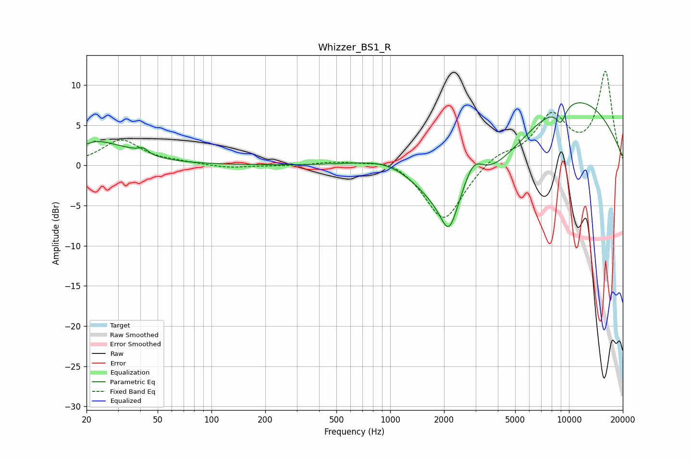

# Whizzer_BS1_R
See [usage instructions](https://github.com/jaakkopasanen/AutoEq#usage) for more options and info.

### Parametric EQs
Apply preamp of -7.9 dB when using parametric equalizer.

|   # | Type    |   Fc (Hz) |    Q |   Gain (dB) |
|-----|---------|-----------|------|-------------|
|   1 | Peaking |        20 | 5.88 |        -0.4 |
|   2 | Peaking |        21 | 0.8  |         3   |
|   3 | Peaking |        36 | 1.93 |         0.3 |
|   4 | Peaking |        42 | 5.51 |         0.7 |
|   5 | Peaking |      1105 | 0.65 |         4.5 |
|   6 | Peaking |      2128 | 3.15 |        -4.2 |
|   7 | Peaking |      2194 | 0.5  |        -9.4 |
|   8 | Peaking |      2905 | 2.24 |         4.3 |
|   9 | Peaking |      9001 | 4.49 |        -2.1 |
|  10 | Peaking |      9828 | 0.35 |         9.1 |

### Fixed Band EQs
When using fixed band (also called graphic) equalizer, apply preamp of **-11.8 dB** (if available) and set gains manually with these parameters.

|   # | Type    |   Fc (Hz) |    Q |   Gain (dB) |
|-----|---------|-----------|------|-------------|
|   1 | Peaking |        31 | 1.41 |         3.1 |
|   2 | Peaking |        62 | 1.41 |         0.3 |
|   3 | Peaking |       125 | 1.41 |        -0.4 |
|   4 | Peaking |       250 | 1.41 |        -0.1 |
|   5 | Peaking |       500 | 1.41 |         0.5 |
|   6 | Peaking |      1000 | 1.41 |         1   |
|   7 | Peaking |      2000 | 1.41 |        -7.1 |
|   8 | Peaking |      4000 | 1.41 |         1.4 |
|   9 | Peaking |      8000 | 1.41 |         5.9 |
|  10 | Peaking |     16000 | 1.41 |        11.5 |

### Graphs

