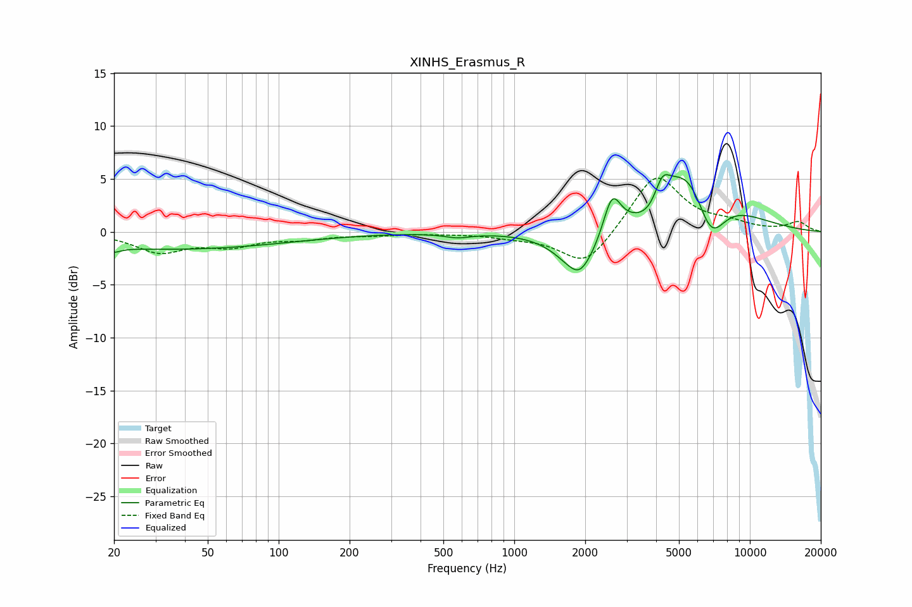

# XINHS_Erasmus_R
See [usage instructions](https://github.com/jaakkopasanen/AutoEq#usage) for more options and info.

### Parametric EQs
Apply preamp of -5.5 dB when using parametric equalizer.

|   # | Type    |   Fc (Hz) |    Q |   Gain (dB) |
|-----|---------|-----------|------|-------------|
|   1 | Peaking |        20 | 4.98 |        -0.4 |
|   2 | Peaking |        35 | 0.28 |        -1.6 |
|   3 | Peaking |       575 | 2.51 |        -0.4 |
|   4 | Peaking |      1890 | 4.45 |        -0.4 |
|   5 | Peaking |      1899 | 1.59 |        -4.5 |
|   6 | Peaking |      2599 | 3.84 |         3.8 |
|   7 | Peaking |      3803 | 1.9  |        -2.2 |
|   8 | Peaking |      4245 | 4.36 |         2.2 |
|   9 | Peaking |      5584 | 0.91 |         8.2 |
|  10 | Peaking |      6793 | 1.95 |        -6.1 |

### Fixed Band EQs
When using fixed band (also called graphic) equalizer, apply preamp of **-5.2 dB** (if available) and set gains manually with these parameters.

|   # | Type    |   Fc (Hz) |    Q |   Gain (dB) |
|-----|---------|-----------|------|-------------|
|   1 | Peaking |        31 | 1.41 |        -1.8 |
|   2 | Peaking |        62 | 1.41 |        -1.2 |
|   3 | Peaking |       125 | 1.41 |        -0.6 |
|   4 | Peaking |       250 | 1.41 |        -0.2 |
|   5 | Peaking |       500 | 1.41 |        -0.1 |
|   6 | Peaking |      1000 | 1.41 |        -0.4 |
|   7 | Peaking |      2000 | 1.41 |        -3.4 |
|   8 | Peaking |      4000 | 1.41 |         5.5 |
|   9 | Peaking |      8000 | 1.41 |         0.7 |
|  10 | Peaking |     16000 | 1.41 |         0.9 |

### Graphs

