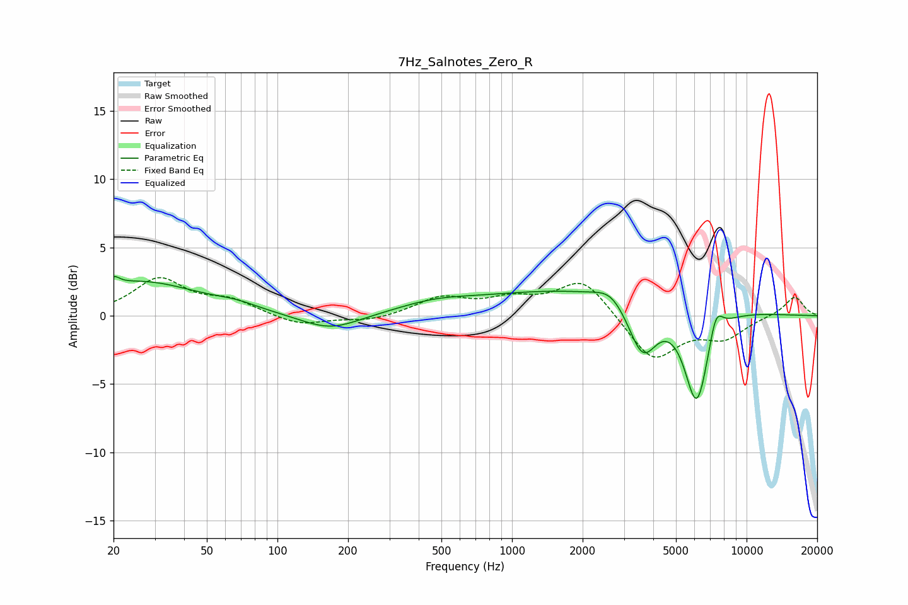

# 7Hz_Salnotes_Zero_R
See [usage instructions](https://github.com/jaakkopasanen/AutoEq#usage) for more options and info.

### Parametric EQs
Apply preamp of -3.0 dB when using parametric equalizer.

|   # | Type    |   Fc (Hz) |    Q |   Gain (dB) |
|-----|---------|-----------|------|-------------|
|   1 | Peaking |        20 | 5.83 |         0.6 |
|   2 | Peaking |        26 | 0.57 |         2.5 |
|   3 | Peaking |        67 | 1.52 |         0.4 |
|   4 | Peaking |       168 | 1.12 |        -1.2 |
|   5 | Peaking |       466 | 0.9  |         0.6 |
|   6 | Peaking |      2170 | 0.29 |         2   |
|   7 | Peaking |      2636 | 2.31 |         0.9 |
|   8 | Peaking |      3602 | 2.26 |        -4   |
|   9 | Peaking |      6131 | 2.59 |        -7.3 |
|  10 | Peaking |      7394 | 4.54 |         2.1 |

### Fixed Band EQs
When using fixed band (also called graphic) equalizer, apply preamp of **-2.9 dB** (if available) and set gains manually with these parameters.

|   # | Type    |   Fc (Hz) |    Q |   Gain (dB) |
|-----|---------|-----------|------|-------------|
|   1 | Peaking |        31 | 1.41 |         2.6 |
|   2 | Peaking |        62 | 1.41 |         1   |
|   3 | Peaking |       125 | 1.41 |        -0.7 |
|   4 | Peaking |       250 | 1.41 |        -0.4 |
|   5 | Peaking |       500 | 1.41 |         1.3 |
|   6 | Peaking |      1000 | 1.41 |         1   |
|   7 | Peaking |      2000 | 1.41 |         2.7 |
|   8 | Peaking |      4000 | 1.41 |        -3.3 |
|   9 | Peaking |      8000 | 1.41 |        -1.5 |
|  10 | Peaking |     16000 | 1.41 |         1.4 |

### Graphs

