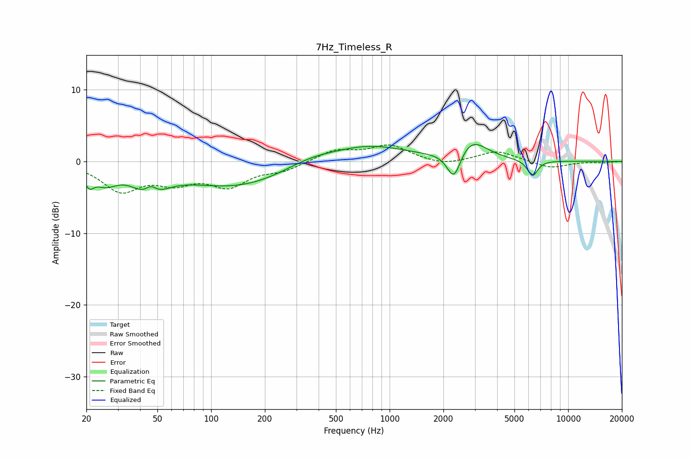

# 7Hz_Timeless_R
See [usage instructions](https://github.com/jaakkopasanen/AutoEq#usage) for more options and info.

### Parametric EQs
Apply preamp of -2.4 dB when using parametric equalizer.

|   # | Type    |   Fc (Hz) |    Q |   Gain (dB) |
|-----|---------|-----------|------|-------------|
|   1 | Peaking |        21 | 5.45 |        -1.9 |
|   2 | Peaking |        26 | 2.14 |        -2.2 |
|   3 | Peaking |        45 | 1.7  |        -3.7 |
|   4 | Peaking |        46 | 4.1  |         1.8 |
|   5 | Peaking |       140 | 0.47 |        -3.5 |
|   6 | Peaking |       356 | 0.93 |         1.2 |
|   7 | Peaking |       768 | 0.67 |         2.2 |
|   8 | Peaking |      2292 | 3.59 |        -4.2 |
|   9 | Peaking |      2851 | 1.66 |         3   |
|  10 | Peaking |      6317 | 4.78 |        -2.3 |

### Fixed Band EQs
When using fixed band (also called graphic) equalizer, apply preamp of **-2.4 dB** (if available) and set gains manually with these parameters.

|   # | Type    |   Fc (Hz) |    Q |   Gain (dB) |
|-----|---------|-----------|------|-------------|
|   1 | Peaking |        31 | 1.41 |        -3.9 |
|   2 | Peaking |        62 | 1.41 |        -2.4 |
|   3 | Peaking |       125 | 1.41 |        -3.1 |
|   4 | Peaking |       250 | 1.41 |        -1.1 |
|   5 | Peaking |       500 | 1.41 |         1.5 |
|   6 | Peaking |      1000 | 1.41 |         2.1 |
|   7 | Peaking |      2000 | 1.41 |        -0.7 |
|   8 | Peaking |      4000 | 1.41 |         1.5 |
|   9 | Peaking |      8000 | 1.41 |        -1   |
|  10 | Peaking |     16000 | 1.41 |        -0.2 |

### Graphs

