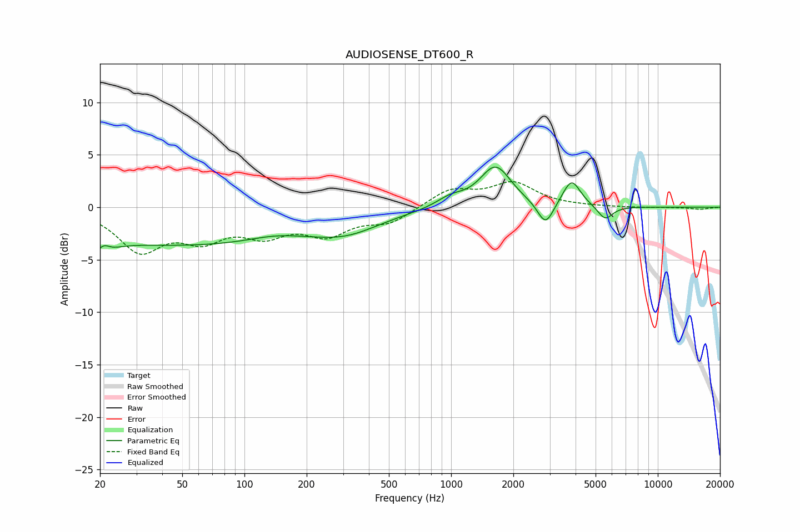

# AUDIOSENSE_DT600_R
See [usage instructions](https://github.com/jaakkopasanen/AutoEq#usage) for more options and info.

### Parametric EQs
Apply preamp of -3.9 dB when using parametric equalizer.

|   # | Type    |   Fc (Hz) |    Q |   Gain (dB) |
|-----|---------|-----------|------|-------------|
|   1 | Peaking |        20 | 2.77 |        -3.4 |
|   2 | Peaking |        21 | 4.04 |         2.5 |
|   3 | Peaking |        52 | 0.22 |        -3.6 |
|   4 | Peaking |       139 | 1.09 |         0.5 |
|   5 | Peaking |       313 | 0.86 |        -1.5 |
|   6 | Peaking |       990 | 2.08 |         0.9 |
|   7 | Peaking |      1639 | 1.88 |         3.9 |
|   8 | Peaking |      2864 | 3.67 |        -2.3 |
|   9 | Peaking |      3827 | 3.27 |         2.6 |
|  10 | Peaking |      5564 | 3.86 |        -1.3 |

### Fixed Band EQs
When using fixed band (also called graphic) equalizer, apply preamp of **-2.5 dB** (if available) and set gains manually with these parameters.

|   # | Type    |   Fc (Hz) |    Q |   Gain (dB) |
|-----|---------|-----------|------|-------------|
|   1 | Peaking |        31 | 1.41 |        -3.9 |
|   2 | Peaking |        62 | 1.41 |        -2.6 |
|   3 | Peaking |       125 | 1.41 |        -2.2 |
|   4 | Peaking |       250 | 1.41 |        -2.3 |
|   5 | Peaking |       500 | 1.41 |        -1.4 |
|   6 | Peaking |      1000 | 1.41 |         1.7 |
|   7 | Peaking |      2000 | 1.41 |         2.2 |
|   8 | Peaking |      4000 | 1.41 |         0   |
|   9 | Peaking |      8000 | 1.41 |        -0   |
|  10 | Peaking |     16000 | 1.41 |        -0.2 |

### Graphs

