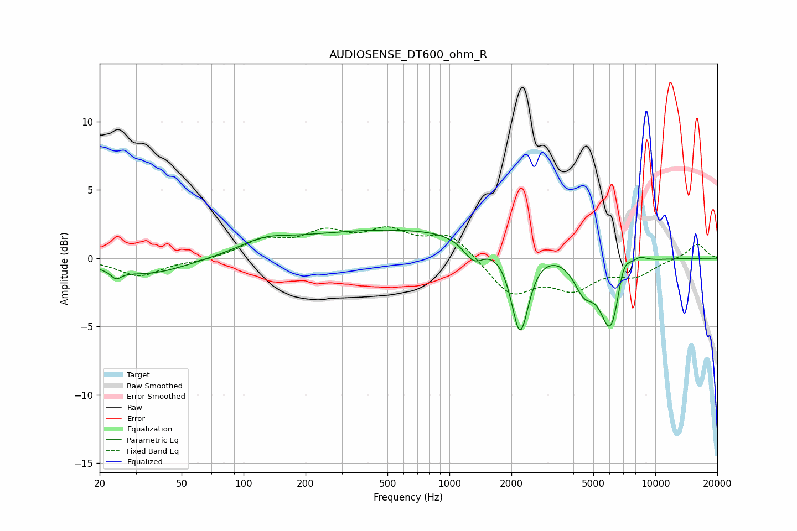

# AUDIOSENSE_DT600_ohm_R
See [usage instructions](https://github.com/jaakkopasanen/AutoEq#usage) for more options and info.

### Parametric EQs
Apply preamp of -2.2 dB when using parametric equalizer.

|   # | Type    |   Fc (Hz) |    Q |   Gain (dB) |
|-----|---------|-----------|------|-------------|
|   1 | Peaking |        24 | 5.71 |        -0.6 |
|   2 | Peaking |        34 | 0.7  |        -1.2 |
|   3 | Peaking |       125 | 1.27 |         0.7 |
|   4 | Peaking |       689 | 0.2  |         2.2 |
|   5 | Peaking |      1312 | 2.69 |        -1.6 |
|   6 | Peaking |      2203 | 3.29 |        -6.5 |
|   7 | Peaking |      4500 | 2.7  |        -2.2 |
|   8 | Peaking |      6090 | 2.63 |        -5.6 |
|   9 | Peaking |      6970 | 3.99 |         2.1 |
|  10 | Peaking |      8323 | 3.18 |         0.6 |

### Fixed Band EQs
When using fixed band (also called graphic) equalizer, apply preamp of **-2.4 dB** (if available) and set gains manually with these parameters.

|   # | Type    |   Fc (Hz) |    Q |   Gain (dB) |
|-----|---------|-----------|------|-------------|
|   1 | Peaking |        31 | 1.41 |        -1.3 |
|   2 | Peaking |        62 | 1.41 |        -0.2 |
|   3 | Peaking |       125 | 1.41 |         1.2 |
|   4 | Peaking |       250 | 1.41 |         1.6 |
|   5 | Peaking |       500 | 1.41 |         1.7 |
|   6 | Peaking |      1000 | 1.41 |         1.8 |
|   7 | Peaking |      2000 | 1.41 |        -2.6 |
|   8 | Peaking |      4000 | 1.41 |        -2   |
|   9 | Peaking |      8000 | 1.41 |        -1.1 |
|  10 | Peaking |     16000 | 1.41 |         1.1 |

### Graphs

