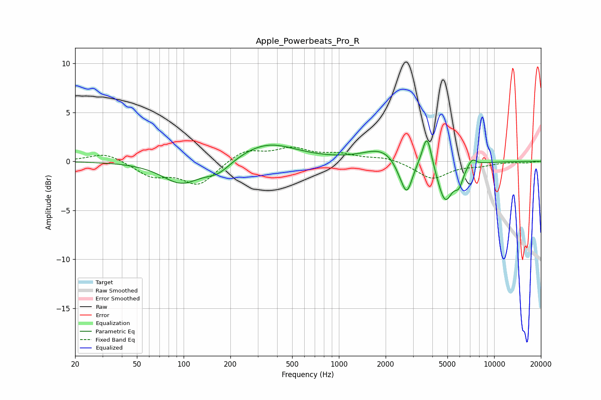

# Apple_Powerbeats_Pro_R
See [usage instructions](https://github.com/jaakkopasanen/AutoEq#usage) for more options and info.

### Parametric EQs
Apply preamp of -2.2 dB when using parametric equalizer.

|   # | Type    |   Fc (Hz) |    Q |   Gain (dB) |
|-----|---------|-----------|------|-------------|
|   1 | Peaking |        96 | 1.14 |        -2.2 |
|   2 | Peaking |       167 | 1.67 |        -1.2 |
|   3 | Peaking |       345 | 0.77 |         1.9 |
|   4 | Peaking |      1899 | 1.21 |         1.3 |
|   5 | Peaking |      2460 | 3.43 |        -0.8 |
|   6 | Peaking |      2742 | 3.99 |        -3.2 |
|   7 | Peaking |      3696 | 4.72 |         3.5 |
|   8 | Peaking |      4831 | 2.81 |        -4.1 |
|   9 | Peaking |      5935 | 5.07 |        -1.5 |
|  10 | Peaking |      7200 | 5.02 |         0.8 |

### Fixed Band EQs
When using fixed band (also called graphic) equalizer, apply preamp of **-1.6 dB** (if available) and set gains manually with these parameters.

|   # | Type    |   Fc (Hz) |    Q |   Gain (dB) |
|-----|---------|-----------|------|-------------|
|   1 | Peaking |        31 | 1.41 |         0.9 |
|   2 | Peaking |        62 | 1.41 |        -1.4 |
|   3 | Peaking |       125 | 1.41 |        -2.4 |
|   4 | Peaking |       250 | 1.41 |         1.2 |
|   5 | Peaking |       500 | 1.41 |         1.2 |
|   6 | Peaking |      1000 | 1.41 |         0.6 |
|   7 | Peaking |      2000 | 1.41 |         0.4 |
|   8 | Peaking |      4000 | 1.41 |        -1.8 |
|   9 | Peaking |      8000 | 1.41 |        -0.4 |
|  10 | Peaking |     16000 | 1.41 |        -0.1 |

### Graphs

