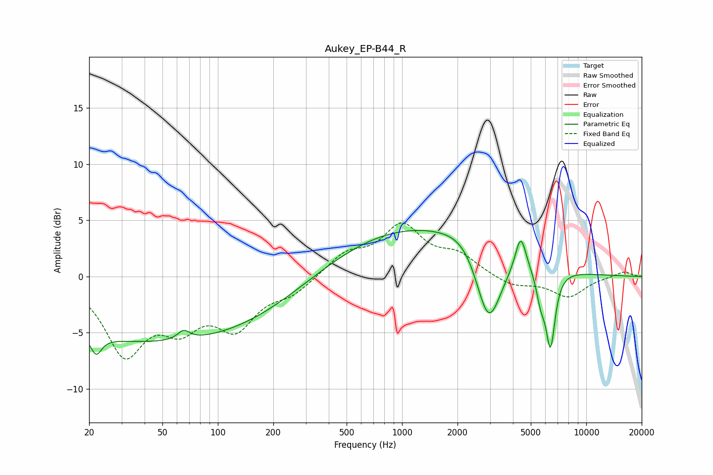

# Aukey_EP-B44_R
See [usage instructions](https://github.com/jaakkopasanen/AutoEq#usage) for more options and info.

### Parametric EQs
Apply preamp of -4.2 dB when using parametric equalizer.

|   # | Type    |   Fc (Hz) |    Q |   Gain (dB) |
|-----|---------|-----------|------|-------------|
|   1 | Peaking |        22 | 4.94 |        -1.6 |
|   2 | Peaking |        47 | 0.18 |        -5.9 |
|   3 | Peaking |        65 | 4.49 |        -0.1 |
|   4 | Peaking |        65 | 4.45 |         1   |
|   5 | Peaking |      1197 | 0.3  |         4.6 |
|   6 | Peaking |      2242 | 1.37 |         1.2 |
|   7 | Peaking |      2946 | 1.97 |        -7.2 |
|   8 | Peaking |      4406 | 4.75 |         3.2 |
|   9 | Peaking |      5664 | 5.71 |        -2.2 |
|  10 | Peaking |      6395 | 5.36 |        -6.6 |

### Fixed Band EQs
When using fixed band (also called graphic) equalizer, apply preamp of **-4.9 dB** (if available) and set gains manually with these parameters.

|   # | Type    |   Fc (Hz) |    Q |   Gain (dB) |
|-----|---------|-----------|------|-------------|
|   1 | Peaking |        31 | 1.41 |        -6.5 |
|   2 | Peaking |        62 | 1.41 |        -3.5 |
|   3 | Peaking |       125 | 1.41 |        -4.1 |
|   4 | Peaking |       250 | 1.41 |        -1.3 |
|   5 | Peaking |       500 | 1.41 |         1.9 |
|   6 | Peaking |      1000 | 1.41 |         4.3 |
|   7 | Peaking |      2000 | 1.41 |         1.7 |
|   8 | Peaking |      4000 | 1.41 |        -0.9 |
|   9 | Peaking |      8000 | 1.41 |        -1.8 |
|  10 | Peaking |     16000 | 1.41 |         0.5 |

### Graphs

