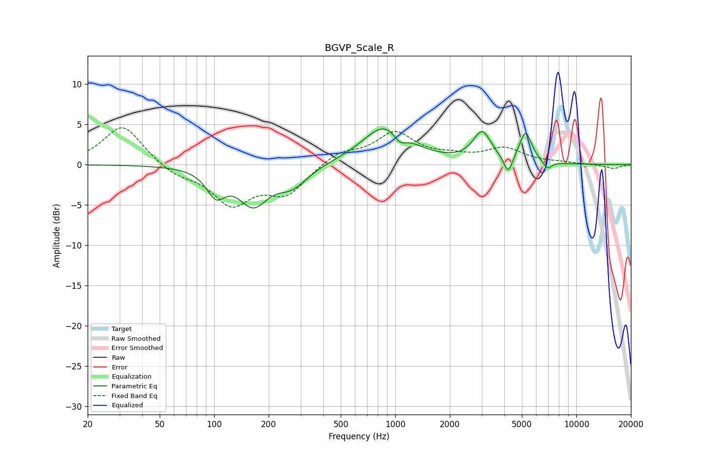

# BGVP_Scale_R
See [usage instructions](https://github.com/jaakkopasanen/AutoEq#usage) for more options and info.

### Parametric EQs
Apply preamp of -4.5 dB when using parametric equalizer.

|   # | Type    |   Fc (Hz) |    Q |   Gain (dB) |
|-----|---------|-----------|------|-------------|
|   1 | Peaking |       102 | 2.77 |        -3.1 |
|   2 | Peaking |       164 | 1.71 |        -4.6 |
|   3 | Peaking |       263 | 2.05 |        -0.6 |
|   4 | Peaking |       275 | 1.58 |        -1.7 |
|   5 | Peaking |       894 | 1.12 |         5   |
|   6 | Peaking |      1058 | 3.8  |        -1.5 |
|   7 | Peaking |      3015 | 2.86 |         3.7 |
|   8 | Peaking |      4203 | 5.97 |        -2.3 |
|   9 | Peaking |      5237 | 4.12 |         3.8 |
|  10 | Peaking |      6923 | 5.99 |        -1   |

### Fixed Band EQs
When using fixed band (also called graphic) equalizer, apply preamp of **-4.7 dB** (if available) and set gains manually with these parameters.

|   # | Type    |   Fc (Hz) |    Q |   Gain (dB) |
|-----|---------|-----------|------|-------------|
|   1 | Peaking |        31 | 1.41 |         5   |
|   2 | Peaking |        62 | 1.41 |        -1.3 |
|   3 | Peaking |       125 | 1.41 |        -4.7 |
|   4 | Peaking |       250 | 1.41 |        -3.4 |
|   5 | Peaking |       500 | 1.41 |         1.5 |
|   6 | Peaking |      1000 | 1.41 |         3.8 |
|   7 | Peaking |      2000 | 1.41 |         0.8 |
|   8 | Peaking |      4000 | 1.41 |         1.9 |
|   9 | Peaking |      8000 | 1.41 |         0.2 |
|  10 | Peaking |     16000 | 1.41 |        -0.5 |

### Graphs

