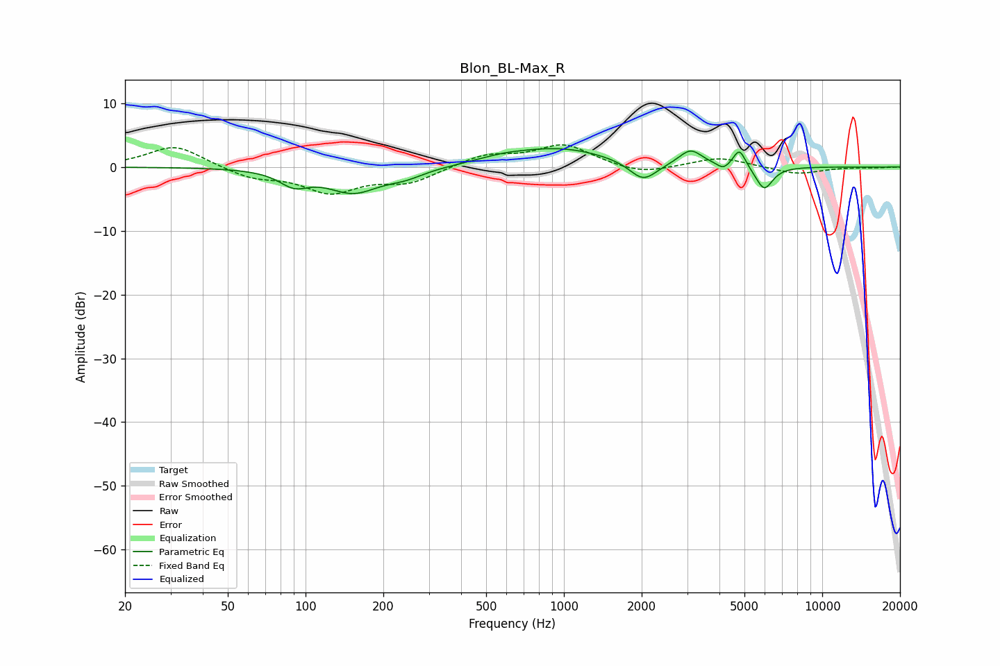

# Blon_BL-Max_R
See [usage instructions](https://github.com/jaakkopasanen/AutoEq#usage) for more options and info.

### Parametric EQs
Apply preamp of -3.0 dB when using parametric equalizer.

|   # | Type    |   Fc (Hz) |    Q |   Gain (dB) |
|-----|---------|-----------|------|-------------|
|   1 | Peaking |        90 | 2.48 |        -2.2 |
|   2 | Peaking |       153 | 1.39 |        -3.8 |
|   3 | Peaking |       243 | 1.86 |        -1.2 |
|   4 | Peaking |       579 | 1.55 |         0.6 |
|   5 | Peaking |       960 | 0.73 |         2.9 |
|   6 | Peaking |      2029 | 2.66 |        -3.1 |
|   7 | Peaking |      3093 | 3.13 |         2.5 |
|   8 | Peaking |      4140 | 6    |        -1   |
|   9 | Peaking |      4782 | 5.99 |         2.9 |
|  10 | Peaking |      5961 | 4.2  |        -3.7 |

### Fixed Band EQs
When using fixed band (also called graphic) equalizer, apply preamp of **-3.6 dB** (if available) and set gains manually with these parameters.

|   # | Type    |   Fc (Hz) |    Q |   Gain (dB) |
|-----|---------|-----------|------|-------------|
|   1 | Peaking |        31 | 1.41 |         3.5 |
|   2 | Peaking |        62 | 1.41 |        -1.6 |
|   3 | Peaking |       125 | 1.41 |        -3.8 |
|   4 | Peaking |       250 | 1.41 |        -2.3 |
|   5 | Peaking |       500 | 1.41 |         1.9 |
|   6 | Peaking |      1000 | 1.41 |         3.4 |
|   7 | Peaking |      2000 | 1.41 |        -1.3 |
|   8 | Peaking |      4000 | 1.41 |         1.5 |
|   9 | Peaking |      8000 | 1.41 |        -1.1 |
|  10 | Peaking |     16000 | 1.41 |        -0.1 |

### Graphs

