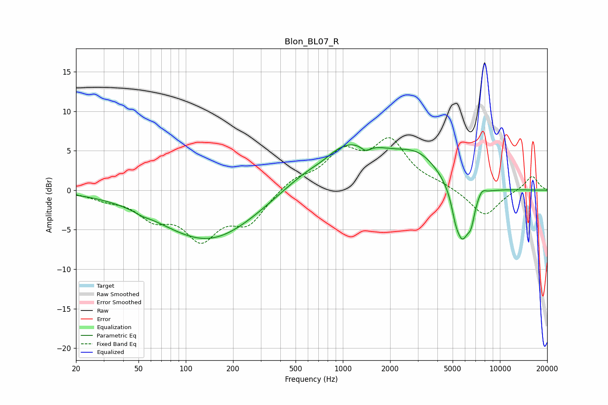

# Blon_BL07_R
See [usage instructions](https://github.com/jaakkopasanen/AutoEq#usage) for more options and info.

### Parametric EQs
Apply preamp of -5.8 dB when using parametric equalizer.

|   # | Type    |   Fc (Hz) |    Q |   Gain (dB) |
|-----|---------|-----------|------|-------------|
|   1 | Peaking |        53 | 3.72 |        -0.2 |
|   2 | Peaking |       141 | 0.45 |        -6.5 |
|   3 | Peaking |       741 | 1.73 |        -0.7 |
|   4 | Peaking |      1057 | 0.54 |         6.3 |
|   5 | Peaking |      1399 | 4.28 |        -0.9 |
|   6 | Peaking |      3072 | 1    |         3   |
|   7 | Peaking |      5207 | 6    |        -1.4 |
|   8 | Peaking |      5752 | 2.92 |        -6.8 |
|   9 | Peaking |      6553 | 6    |        -2.3 |
|  10 | Peaking |      7666 | 5.33 |         0.8 |

### Fixed Band EQs
When using fixed band (also called graphic) equalizer, apply preamp of **-6.7 dB** (if available) and set gains manually with these parameters.

|   # | Type    |   Fc (Hz) |    Q |   Gain (dB) |
|-----|---------|-----------|------|-------------|
|   1 | Peaking |        31 | 1.41 |        -0.9 |
|   2 | Peaking |        62 | 1.41 |        -3   |
|   3 | Peaking |       125 | 1.41 |        -5.5 |
|   4 | Peaking |       250 | 1.41 |        -3.8 |
|   5 | Peaking |       500 | 1.41 |         1.4 |
|   6 | Peaking |      1000 | 1.41 |         4.3 |
|   7 | Peaking |      2000 | 1.41 |         5.8 |
|   8 | Peaking |      4000 | 1.41 |         0.6 |
|   9 | Peaking |      8000 | 1.41 |        -3.4 |
|  10 | Peaking |     16000 | 1.41 |         1.9 |

### Graphs

