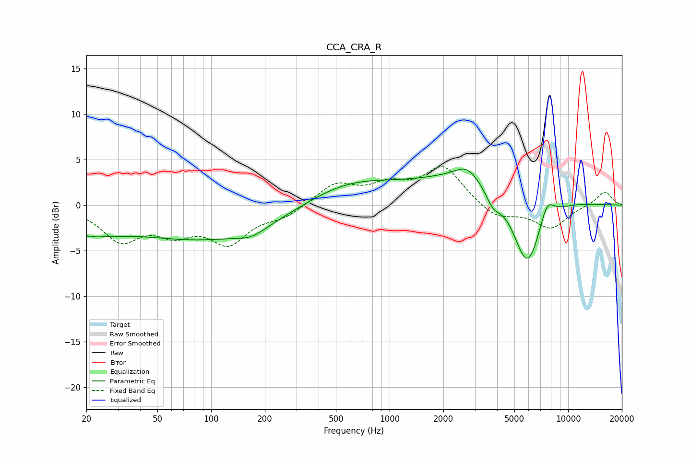

# CCA_CRA_R
See [usage instructions](https://github.com/jaakkopasanen/AutoEq#usage) for more options and info.

### Parametric EQs
Apply preamp of -4.1 dB when using parametric equalizer.

|   # | Type    |   Fc (Hz) |    Q |   Gain (dB) |
|-----|---------|-----------|------|-------------|
|   1 | Peaking |        21 | 5.84 |        -0.6 |
|   2 | Peaking |        24 | 1.01 |        -1.7 |
|   3 | Peaking |        97 | 0.31 |        -3.8 |
|   4 | Peaking |       169 | 1.78 |        -0.8 |
|   5 | Peaking |       573 | 0.52 |         2.7 |
|   6 | Peaking |      2695 | 2.22 |         1.3 |
|   7 | Peaking |      3301 | 0.44 |         3.6 |
|   8 | Peaking |      3800 | 3.19 |        -1.8 |
|   9 | Peaking |      5879 | 1.62 |        -8.9 |
|  10 | Peaking |      7613 | 3.46 |         2.3 |

### Fixed Band EQs
When using fixed band (also called graphic) equalizer, apply preamp of **-4.3 dB** (if available) and set gains manually with these parameters.

|   # | Type    |   Fc (Hz) |    Q |   Gain (dB) |
|-----|---------|-----------|------|-------------|
|   1 | Peaking |        31 | 1.41 |        -3.6 |
|   2 | Peaking |        62 | 1.41 |        -2.5 |
|   3 | Peaking |       125 | 1.41 |        -3.8 |
|   4 | Peaking |       250 | 1.41 |        -1.2 |
|   5 | Peaking |       500 | 1.41 |         2.3 |
|   6 | Peaking |      1000 | 1.41 |         1.9 |
|   7 | Peaking |      2000 | 1.41 |         4.1 |
|   8 | Peaking |      4000 | 1.41 |        -1.5 |
|   9 | Peaking |      8000 | 1.41 |        -2.5 |
|  10 | Peaking |     16000 | 1.41 |         1.6 |

### Graphs

