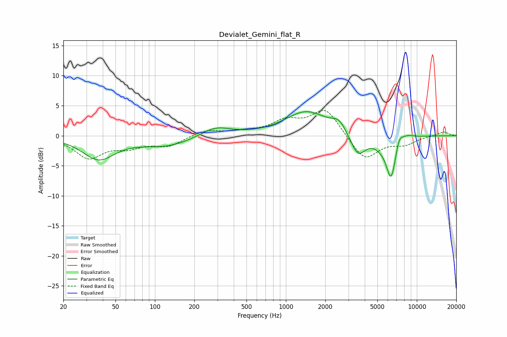

# Devialet_Gemini_flat_R
See [usage instructions](https://github.com/jaakkopasanen/AutoEq#usage) for more options and info.

### Parametric EQs
Apply preamp of -4.1 dB when using parametric equalizer.

|   # | Type    |   Fc (Hz) |    Q |   Gain (dB) |
|-----|---------|-----------|------|-------------|
|   1 | Peaking |        37 | 1.15 |        -3.8 |
|   2 | Peaking |       123 | 0.72 |        -1.7 |
|   3 | Peaking |       290 | 1.21 |         1.6 |
|   4 | Peaking |      1436 | 0.87 |         4   |
|   5 | Peaking |      2551 | 2.56 |         1.8 |
|   6 | Peaking |      3550 | 2.37 |        -3.7 |
|   7 | Peaking |      5298 | 2.27 |        -1   |
|   8 | Peaking |      6359 | 3.63 |        -6.8 |
|   9 | Peaking |      7340 | 4.81 |         1.8 |
|  10 | Peaking |      8489 | 2.89 |         0.6 |

### Fixed Band EQs
When using fixed band (also called graphic) equalizer, apply preamp of **-4.3 dB** (if available) and set gains manually with these parameters.

|   # | Type    |   Fc (Hz) |    Q |   Gain (dB) |
|-----|---------|-----------|------|-------------|
|   1 | Peaking |        31 | 1.41 |        -3.6 |
|   2 | Peaking |        62 | 1.41 |        -1.6 |
|   3 | Peaking |       125 | 1.41 |        -1.6 |
|   4 | Peaking |       250 | 1.41 |         1   |
|   5 | Peaking |       500 | 1.41 |         0.5 |
|   6 | Peaking |      1000 | 1.41 |         2.2 |
|   7 | Peaking |      2000 | 1.41 |         4.5 |
|   8 | Peaking |      4000 | 1.41 |        -4.2 |
|   9 | Peaking |      8000 | 1.41 |        -1.3 |
|  10 | Peaking |     16000 | 1.41 |         0.7 |

### Graphs

