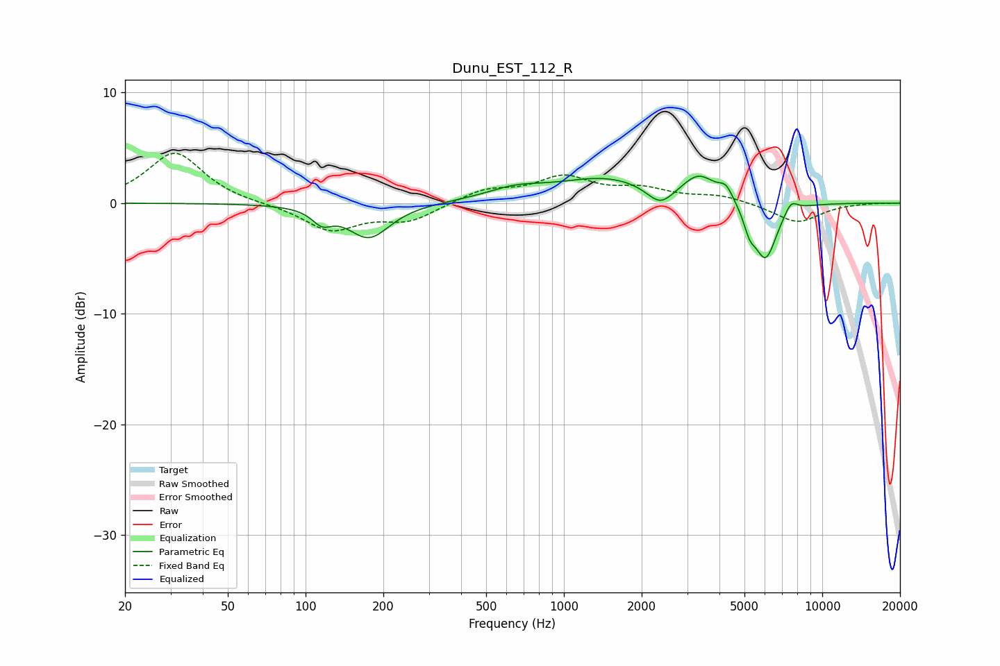

# Dunu_EST_112_R
See [usage instructions](https://github.com/jaakkopasanen/AutoEq#usage) for more options and info.

### Parametric EQs
Apply preamp of -2.5 dB when using parametric equalizer.

|   # | Type    |   Fc (Hz) |    Q |   Gain (dB) |
|-----|---------|-----------|------|-------------|
|   1 | Peaking |       116 | 3.76 |        -1.2 |
|   2 | Peaking |       176 | 1.75 |        -3.1 |
|   3 | Peaking |       645 | 1.25 |         0.9 |
|   4 | Peaking |      1468 | 0.72 |         2.2 |
|   5 | Peaking |      2361 | 2.7  |        -1.7 |
|   6 | Peaking |      3336 | 2.24 |         2.1 |
|   7 | Peaking |      4240 | 4.82 |         1.2 |
|   8 | Peaking |      5238 | 5.98 |        -1.6 |
|   9 | Peaking |      6034 | 3.11 |        -5.2 |
|  10 | Peaking |      7571 | 5.33 |         1.1 |

### Fixed Band EQs
When using fixed band (also called graphic) equalizer, apply preamp of **-4.6 dB** (if available) and set gains manually with these parameters.

|   # | Type    |   Fc (Hz) |    Q |   Gain (dB) |
|-----|---------|-----------|------|-------------|
|   1 | Peaking |        31 | 1.41 |         4.6 |
|   2 | Peaking |        62 | 1.41 |        -0.1 |
|   3 | Peaking |       125 | 1.41 |        -2.4 |
|   4 | Peaking |       250 | 1.41 |        -1.5 |
|   5 | Peaking |       500 | 1.41 |         1.2 |
|   6 | Peaking |      1000 | 1.41 |         2.2 |
|   7 | Peaking |      2000 | 1.41 |         1.1 |
|   8 | Peaking |      4000 | 1.41 |         0.7 |
|   9 | Peaking |      8000 | 1.41 |        -1.8 |
|  10 | Peaking |     16000 | 1.41 |         0   |

### Graphs

