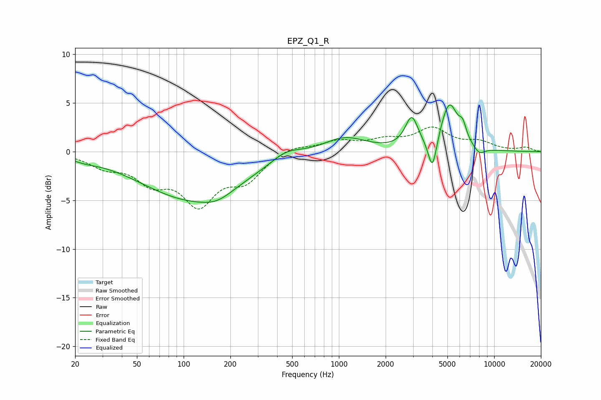

# EPZ_Q1_R
See [usage instructions](https://github.com/jaakkopasanen/AutoEq#usage) for more options and info.

### Parametric EQs
Apply preamp of -4.9 dB when using parametric equalizer.

|   # | Type    |   Fc (Hz) |    Q |   Gain (dB) |
|-----|---------|-----------|------|-------------|
|   1 | Peaking |        23 | 1.85 |        -0.3 |
|   2 | Peaking |       113 | 0.43 |        -4.8 |
|   3 | Peaking |       164 | 1.44 |        -0.8 |
|   4 | Peaking |       458 | 1.45 |         1   |
|   5 | Peaking |      1088 | 1.05 |         1.5 |
|   6 | Peaking |      2942 | 3.44 |         3.1 |
|   7 | Peaking |      4004 | 5.11 |        -3.5 |
|   8 | Peaking |      5142 | 2.5  |         4.8 |
|   9 | Peaking |      6275 | 5.86 |         1.4 |
|  10 | Peaking |      8011 | 3.64 |        -0.8 |

### Fixed Band EQs
When using fixed band (also called graphic) equalizer, apply preamp of **-2.6 dB** (if available) and set gains manually with these parameters.

|   # | Type    |   Fc (Hz) |    Q |   Gain (dB) |
|-----|---------|-----------|------|-------------|
|   1 | Peaking |        31 | 1.41 |        -1.3 |
|   2 | Peaking |        62 | 1.41 |        -2.6 |
|   3 | Peaking |       125 | 1.41 |        -4.9 |
|   4 | Peaking |       250 | 1.41 |        -2.6 |
|   5 | Peaking |       500 | 1.41 |         0.7 |
|   6 | Peaking |      1000 | 1.41 |         1   |
|   7 | Peaking |      2000 | 1.41 |         1   |
|   8 | Peaking |      4000 | 1.41 |         2.2 |
|   9 | Peaking |      8000 | 1.41 |         0.8 |
|  10 | Peaking |     16000 | 1.41 |         0.4 |

### Graphs

