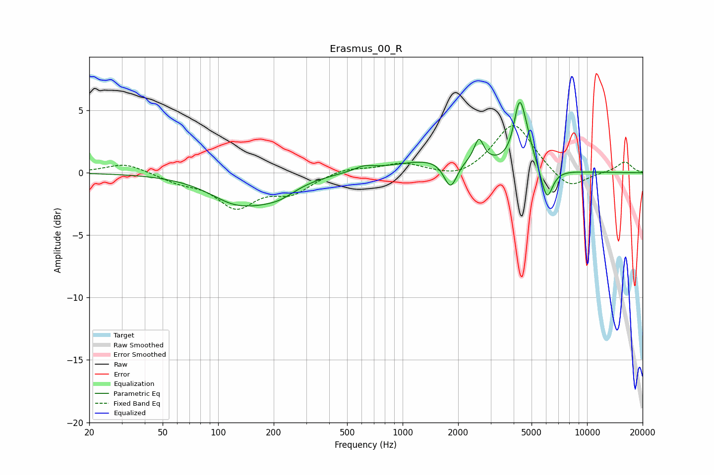

# Erasmus_00_R
See [usage instructions](https://github.com/jaakkopasanen/AutoEq#usage) for more options and info.

### Parametric EQs
Apply preamp of -5.7 dB when using parametric equalizer.

|   # | Type    |   Fc (Hz) |    Q |   Gain (dB) |
|-----|---------|-----------|------|-------------|
|   1 | Peaking |       135 | 0.9  |        -2.6 |
|   2 | Peaking |       140 | 2.15 |         0.2 |
|   3 | Peaking |       217 | 1.53 |        -0.8 |
|   4 | Peaking |       617 | 2.77 |         0.4 |
|   5 | Peaking |      1673 | 0.6  |         1.2 |
|   6 | Peaking |      1819 | 3.9  |        -2.3 |
|   7 | Peaking |      2593 | 5.66 |         1.8 |
|   8 | Peaking |      4286 | 4.78 |         4   |
|   9 | Peaking |      4635 | 3.48 |         1.9 |
|  10 | Peaking |      6058 | 4.35 |        -2.6 |

### Fixed Band EQs
When using fixed band (also called graphic) equalizer, apply preamp of **-3.9 dB** (if available) and set gains manually with these parameters.

|   # | Type    |   Fc (Hz) |    Q |   Gain (dB) |
|-----|---------|-----------|------|-------------|
|   1 | Peaking |        31 | 1.41 |         0.8 |
|   2 | Peaking |        62 | 1.41 |        -0.6 |
|   3 | Peaking |       125 | 1.41 |        -2.6 |
|   4 | Peaking |       250 | 1.41 |        -1.4 |
|   5 | Peaking |       500 | 1.41 |         0.4 |
|   6 | Peaking |      1000 | 1.41 |         0.7 |
|   7 | Peaking |      2000 | 1.41 |        -0.6 |
|   8 | Peaking |      4000 | 1.41 |         4   |
|   9 | Peaking |      8000 | 1.41 |        -1.5 |
|  10 | Peaking |     16000 | 1.41 |         0.9 |

### Graphs

