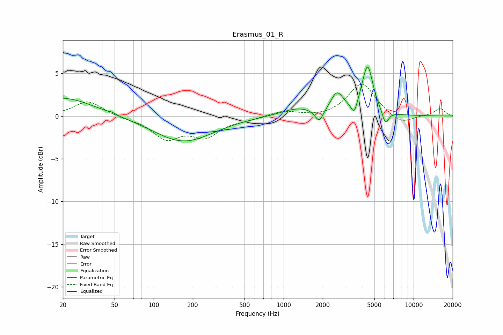

# Erasmus_01_R
See [usage instructions](https://github.com/jaakkopasanen/AutoEq#usage) for more options and info.

### Parametric EQs
Apply preamp of -5.8 dB when using parametric equalizer.

|   # | Type    |   Fc (Hz) |    Q |   Gain (dB) |
|-----|---------|-----------|------|-------------|
|   1 | Peaking |        20 | 0.61 |         2.2 |
|   2 | Peaking |        48 | 5.95 |         0.1 |
|   3 | Peaking |       169 | 0.62 |        -3   |
|   4 | Peaking |      1291 | 1.07 |         0.9 |
|   5 | Peaking |      1879 | 4.44 |        -1.5 |
|   6 | Peaking |      2575 | 2.94 |         2.3 |
|   7 | Peaking |      3494 | 5.98 |        -1.6 |
|   8 | Peaking |      4153 | 1.82 |         0.6 |
|   9 | Peaking |      4431 | 3.53 |         5.2 |
|  10 | Peaking |      6072 | 5.56 |        -1.7 |

### Fixed Band EQs
When using fixed band (also called graphic) equalizer, apply preamp of **-3.8 dB** (if available) and set gains manually with these parameters.

|   # | Type    |   Fc (Hz) |    Q |   Gain (dB) |
|-----|---------|-----------|------|-------------|
|   1 | Peaking |        31 | 1.41 |         1.8 |
|   2 | Peaking |        62 | 1.41 |        -0.2 |
|   3 | Peaking |       125 | 1.41 |        -2.5 |
|   4 | Peaking |       250 | 1.41 |        -2.2 |
|   5 | Peaking |       500 | 1.41 |        -0.3 |
|   6 | Peaking |      1000 | 1.41 |         0.6 |
|   7 | Peaking |      2000 | 1.41 |        -0.2 |
|   8 | Peaking |      4000 | 1.41 |         3.9 |
|   9 | Peaking |      8000 | 1.41 |        -1.1 |
|  10 | Peaking |     16000 | 1.41 |         0.9 |

### Graphs

