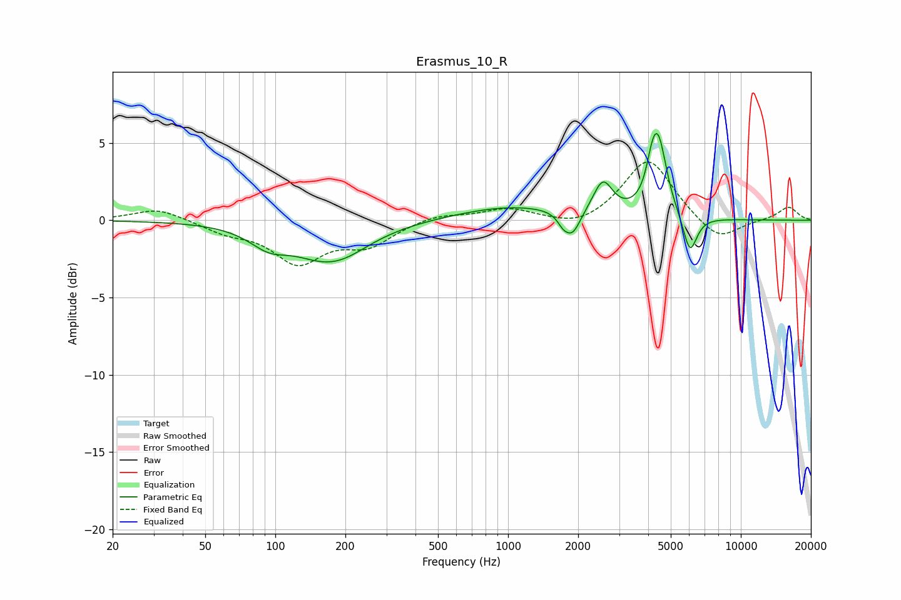

# Erasmus_10_R
See [usage instructions](https://github.com/jaakkopasanen/AutoEq#usage) for more options and info.

### Parametric EQs
Apply preamp of -5.7 dB when using parametric equalizer.

|   # | Type    |   Fc (Hz) |    Q |   Gain (dB) |
|-----|---------|-----------|------|-------------|
|   1 | Peaking |        94 | 1.69 |        -1.1 |
|   2 | Peaking |       171 | 1.94 |         0.1 |
|   3 | Peaking |       174 | 0.96 |        -2.7 |
|   4 | Peaking |      1038 | 0.59 |         0.9 |
|   5 | Peaking |      1722 | 5.98 |        -0.5 |
|   6 | Peaking |      1891 | 3.96 |        -1.6 |
|   7 | Peaking |      2556 | 3.43 |         2.1 |
|   8 | Peaking |      4154 | 5.99 |         1.2 |
|   9 | Peaking |      4418 | 3.85 |         4.8 |
|  10 | Peaking |      6046 | 4.65 |        -2.5 |

### Fixed Band EQs
When using fixed band (also called graphic) equalizer, apply preamp of **-3.9 dB** (if available) and set gains manually with these parameters.

|   # | Type    |   Fc (Hz) |    Q |   Gain (dB) |
|-----|---------|-----------|------|-------------|
|   1 | Peaking |        31 | 1.41 |         0.8 |
|   2 | Peaking |        62 | 1.41 |        -0.7 |
|   3 | Peaking |       125 | 1.41 |        -2.6 |
|   4 | Peaking |       250 | 1.41 |        -1.5 |
|   5 | Peaking |       500 | 1.41 |         0.4 |
|   6 | Peaking |      1000 | 1.41 |         0.7 |
|   7 | Peaking |      2000 | 1.41 |        -0.6 |
|   8 | Peaking |      4000 | 1.41 |         4.1 |
|   9 | Peaking |      8000 | 1.41 |        -1.5 |
|  10 | Peaking |     16000 | 1.41 |         0.9 |

### Graphs

