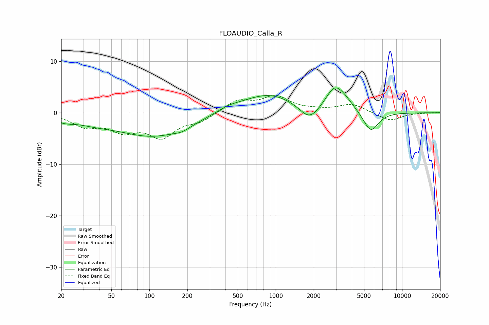

# FLOAUDIO_Calla_R
See [usage instructions](https://github.com/jaakkopasanen/AutoEq#usage) for more options and info.

### Parametric EQs
Apply preamp of -4.9 dB when using parametric equalizer.

|   # | Type    |   Fc (Hz) |    Q |   Gain (dB) |
|-----|---------|-----------|------|-------------|
|   1 | Peaking |        21 | 1.87 |        -0.9 |
|   2 | Peaking |        36 | 0.9  |        -1.1 |
|   3 | Peaking |       109 | 0.5  |        -4.5 |
|   4 | Peaking |       182 | 2.44 |        -0.6 |
|   5 | Peaking |       420 | 1.55 |         0.8 |
|   6 | Peaking |       875 | 0.65 |         3.7 |
|   7 | Peaking |      1852 | 1.8  |        -3.1 |
|   8 | Peaking |      2924 | 1.96 |         4.4 |
|   9 | Peaking |      3565 | 1.96 |         1.3 |
|  10 | Peaking |      5652 | 2.33 |        -4   |

### Fixed Band EQs
When using fixed band (also called graphic) equalizer, apply preamp of **-3.5 dB** (if available) and set gains manually with these parameters.

|   # | Type    |   Fc (Hz) |    Q |   Gain (dB) |
|-----|---------|-----------|------|-------------|
|   1 | Peaking |        31 | 1.41 |        -2.4 |
|   2 | Peaking |        62 | 1.41 |        -3   |
|   3 | Peaking |       125 | 1.41 |        -4.3 |
|   4 | Peaking |       250 | 1.41 |        -1.5 |
|   5 | Peaking |       500 | 1.41 |         2.3 |
|   6 | Peaking |      1000 | 1.41 |         3   |
|   7 | Peaking |      2000 | 1.41 |         0.3 |
|   8 | Peaking |      4000 | 1.41 |         1.7 |
|   9 | Peaking |      8000 | 1.41 |        -1.6 |
|  10 | Peaking |     16000 | 1.41 |        -0   |

### Graphs

