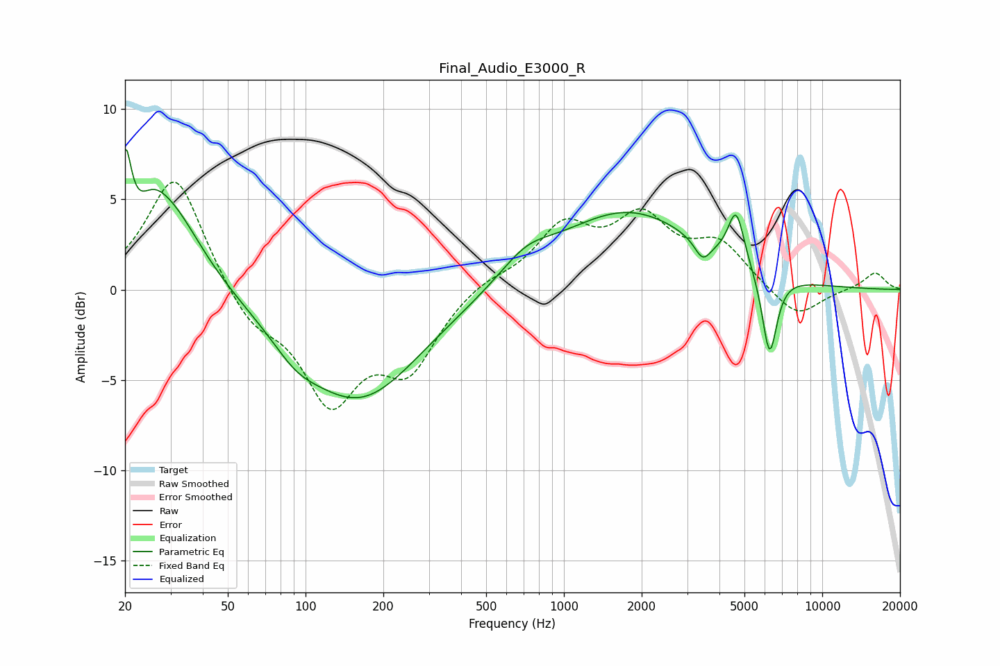

# Final_Audio_E3000_R
See [usage instructions](https://github.com/jaakkopasanen/AutoEq#usage) for more options and info.

### Parametric EQs
Apply preamp of -7.9 dB when using parametric equalizer.

|   # | Type    |   Fc (Hz) |    Q |   Gain (dB) |
|-----|---------|-----------|------|-------------|
|   1 | Peaking |        20 | 6    |         5   |
|   2 | Peaking |        25 | 2.54 |         1.3 |
|   3 | Peaking |        30 | 1.11 |         4.6 |
|   4 | Peaking |        92 | 1.6  |        -1   |
|   5 | Peaking |       161 | 0.59 |        -6.1 |
|   6 | Peaking |       713 | 1.39 |         1.2 |
|   7 | Peaking |      1760 | 0.52 |         4.3 |
|   8 | Peaking |      3445 | 4.48 |        -1.1 |
|   9 | Peaking |      4644 | 4.47 |         2.9 |
|  10 | Peaking |      6253 | 4.75 |        -4.6 |

### Fixed Band EQs
When using fixed band (also called graphic) equalizer, apply preamp of **-6.0 dB** (if available) and set gains manually with these parameters.

|   # | Type    |   Fc (Hz) |    Q |   Gain (dB) |
|-----|---------|-----------|------|-------------|
|   1 | Peaking |        31 | 1.41 |         6.5 |
|   2 | Peaking |        62 | 1.41 |        -1.9 |
|   3 | Peaking |       125 | 1.41 |        -5.8 |
|   4 | Peaking |       250 | 1.41 |        -4   |
|   5 | Peaking |       500 | 1.41 |         0.6 |
|   6 | Peaking |      1000 | 1.41 |         3.2 |
|   7 | Peaking |      2000 | 1.41 |         3.5 |
|   8 | Peaking |      4000 | 1.41 |         2.3 |
|   9 | Peaking |      8000 | 1.41 |        -1.7 |
|  10 | Peaking |     16000 | 1.41 |         1   |

### Graphs

