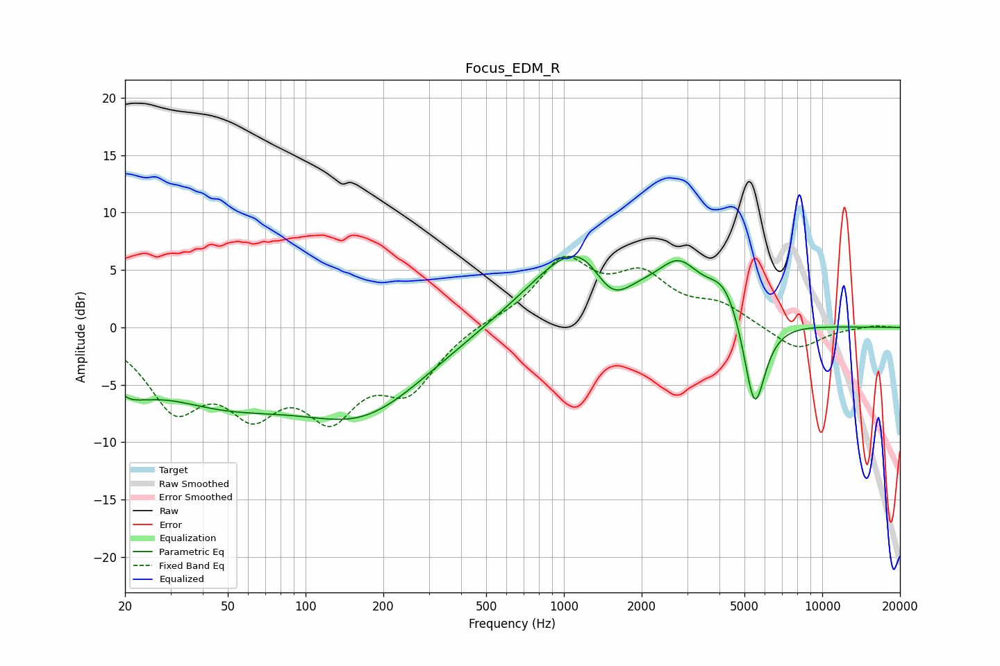

# Focus_EDM_R
See [usage instructions](https://github.com/jaakkopasanen/AutoEq#usage) for more options and info.

### Parametric EQs
Apply preamp of -6.3 dB when using parametric equalizer.

|   # | Type    |   Fc (Hz) |    Q |   Gain (dB) |
|-----|---------|-----------|------|-------------|
|   1 | Peaking |        21 | 1.41 |        -2.4 |
|   2 | Peaking |        21 | 4.91 |        -0.2 |
|   3 | Peaking |        46 | 0.47 |        -5.4 |
|   4 | Peaking |       171 | 0.56 |        -6.2 |
|   5 | Peaking |       364 | 0.18 |        -0.3 |
|   6 | Peaking |      1231 | 0.73 |         9.4 |
|   7 | Peaking |      1521 | 1.62 |        -5   |
|   8 | Peaking |      2795 | 1.83 |         3.2 |
|   9 | Peaking |      4213 | 2.04 |         3.2 |
|  10 | Peaking |      5469 | 3.21 |        -8.6 |

### Fixed Band EQs
When using fixed band (also called graphic) equalizer, apply preamp of **-6.3 dB** (if available) and set gains manually with these parameters.

|   # | Type    |   Fc (Hz) |    Q |   Gain (dB) |
|-----|---------|-----------|------|-------------|
|   1 | Peaking |        31 | 1.41 |        -6.3 |
|   2 | Peaking |        62 | 1.41 |        -5.8 |
|   3 | Peaking |       125 | 1.41 |        -6.5 |
|   4 | Peaking |       250 | 1.41 |        -4.8 |
|   5 | Peaking |       500 | 1.41 |         0.5 |
|   6 | Peaking |      1000 | 1.41 |         5.6 |
|   7 | Peaking |      2000 | 1.41 |         3.9 |
|   8 | Peaking |      4000 | 1.41 |         1.7 |
|   9 | Peaking |      8000 | 1.41 |        -2.1 |
|  10 | Peaking |     16000 | 1.41 |         0.2 |

### Graphs

