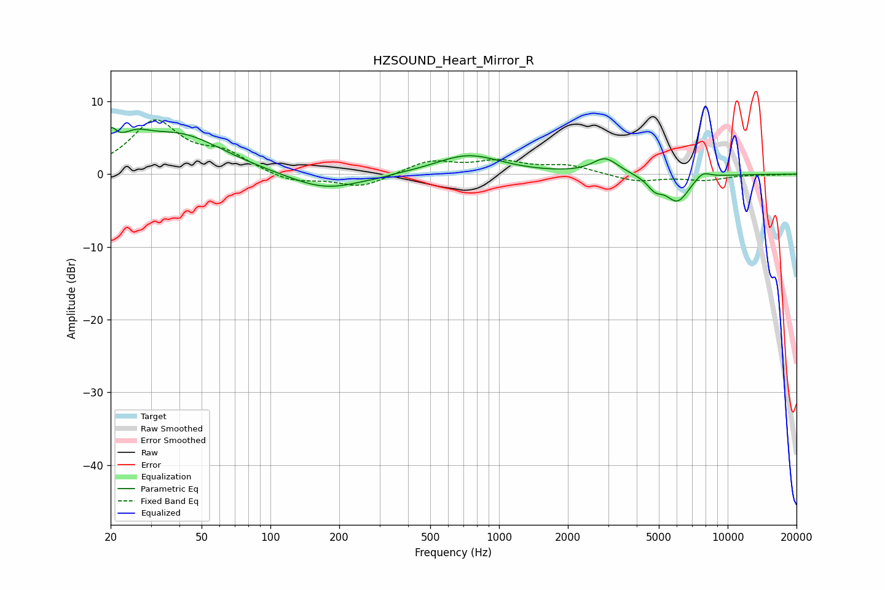

# HZSOUND_Heart_Mirror_R
See [usage instructions](https://github.com/jaakkopasanen/AutoEq#usage) for more options and info.

### Parametric EQs
Apply preamp of -6.5 dB when using parametric equalizer.

|   # | Type    |   Fc (Hz) |    Q |   Gain (dB) |
|-----|---------|-----------|------|-------------|
|   1 | Peaking |        20 | 5.8  |         2.8 |
|   2 | Peaking |        25 | 2    |         2.4 |
|   3 | Peaking |        40 | 0.74 |         5.2 |
|   4 | Peaking |       175 | 0.89 |        -2.4 |
|   5 | Peaking |       291 | 5.89 |        -0.1 |
|   6 | Peaking |       732 | 0.99 |         2.7 |
|   7 | Peaking |      2918 | 2.54 |         2.2 |
|   8 | Peaking |      4803 | 4.11 |        -1.5 |
|   9 | Peaking |      6033 | 2.57 |        -3.7 |
|  10 | Peaking |      7762 | 3.79 |         1.1 |

### Fixed Band EQs
When using fixed band (also called graphic) equalizer, apply preamp of **-7.6 dB** (if available) and set gains manually with these parameters.

|   # | Type    |   Fc (Hz) |    Q |   Gain (dB) |
|-----|---------|-----------|------|-------------|
|   1 | Peaking |        31 | 1.41 |         7.1 |
|   2 | Peaking |        62 | 1.41 |         2.4 |
|   3 | Peaking |       125 | 1.41 |        -1.2 |
|   4 | Peaking |       250 | 1.41 |        -1.8 |
|   5 | Peaking |       500 | 1.41 |         1.8 |
|   6 | Peaking |      1000 | 1.41 |         1.6 |
|   7 | Peaking |      2000 | 1.41 |         1.1 |
|   8 | Peaking |      4000 | 1.41 |        -1   |
|   9 | Peaking |      8000 | 1.41 |        -0.8 |
|  10 | Peaking |     16000 | 1.41 |        -0.1 |

### Graphs

