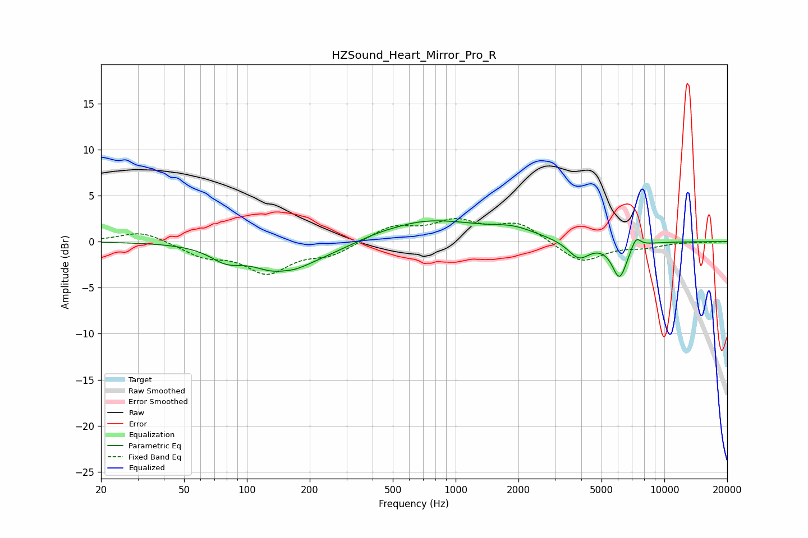

# HZSound_Heart_Mirror_Pro_R
See [usage instructions](https://github.com/jaakkopasanen/AutoEq#usage) for more options and info.

### Parametric EQs
Apply preamp of -2.4 dB when using parametric equalizer.

|   # | Type    |   Fc (Hz) |    Q |   Gain (dB) |
|-----|---------|-----------|------|-------------|
|   1 | Peaking |        79 | 1.86 |        -1.4 |
|   2 | Peaking |       147 | 1.12 |        -3.4 |
|   3 | Peaking |       149 | 2.54 |         0.5 |
|   4 | Peaking |       258 | 0.89 |        -1   |
|   5 | Peaking |       532 | 2.09 |        -0.1 |
|   6 | Peaking |       707 | 0.53 |         2.5 |
|   7 | Peaking |      1902 | 1.36 |         0.9 |
|   8 | Peaking |      3893 | 2.69 |        -1.9 |
|   9 | Peaking |      6100 | 3.82 |        -3.9 |
|  10 | Peaking |      7314 | 5.97 |         1.2 |

### Fixed Band EQs
When using fixed band (also called graphic) equalizer, apply preamp of **-2.6 dB** (if available) and set gains manually with these parameters.

|   # | Type    |   Fc (Hz) |    Q |   Gain (dB) |
|-----|---------|-----------|------|-------------|
|   1 | Peaking |        31 | 1.41 |         1.2 |
|   2 | Peaking |        62 | 1.41 |        -1.4 |
|   3 | Peaking |       125 | 1.41 |        -3.2 |
|   4 | Peaking |       250 | 1.41 |        -1.3 |
|   5 | Peaking |       500 | 1.41 |         1.6 |
|   6 | Peaking |      1000 | 1.41 |         2   |
|   7 | Peaking |      2000 | 1.41 |         1.9 |
|   8 | Peaking |      4000 | 1.41 |        -2.3 |
|   9 | Peaking |      8000 | 1.41 |        -0.5 |
|  10 | Peaking |     16000 | 1.41 |        -0   |

### Graphs

