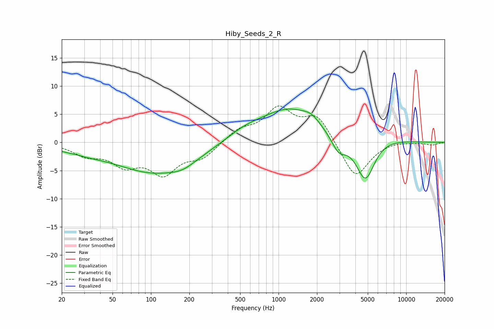

# Hiby_Seeds_2_R
See [usage instructions](https://github.com/jaakkopasanen/AutoEq#usage) for more options and info.

### Parametric EQs
Apply preamp of -6.0 dB when using parametric equalizer.

|   # | Type    |   Fc (Hz) |    Q |   Gain (dB) |
|-----|---------|-----------|------|-------------|
|   1 | Peaking |        20 | 1.57 |        -0.4 |
|   2 | Peaking |        32 | 1.01 |        -0.7 |
|   3 | Peaking |       108 | 0.45 |        -5.3 |
|   4 | Peaking |       178 | 1.48 |        -1   |
|   5 | Peaking |       541 | 0.94 |         1.5 |
|   6 | Peaking |      1226 | 0.63 |         5.7 |
|   7 | Peaking |      1812 | 2.26 |         1.1 |
|   8 | Peaking |      2953 | 2.4  |        -2.9 |
|   9 | Peaking |      4792 | 1.8  |        -8.2 |
|  10 | Peaking |      5589 | 0.79 |         1.4 |

### Fixed Band EQs
When using fixed band (also called graphic) equalizer, apply preamp of **-6.6 dB** (if available) and set gains manually with these parameters.

|   # | Type    |   Fc (Hz) |    Q |   Gain (dB) |
|-----|---------|-----------|------|-------------|
|   1 | Peaking |        31 | 1.41 |        -2   |
|   2 | Peaking |        62 | 1.41 |        -3.5 |
|   3 | Peaking |       125 | 1.41 |        -5.1 |
|   4 | Peaking |       250 | 1.41 |        -2.5 |
|   5 | Peaking |       500 | 1.41 |         2.1 |
|   6 | Peaking |      1000 | 1.41 |         5.6 |
|   7 | Peaking |      2000 | 1.41 |         4.6 |
|   8 | Peaking |      4000 | 1.41 |        -6.6 |
|   9 | Peaking |      8000 | 1.41 |         0.3 |
|  10 | Peaking |     16000 | 1.41 |        -0.4 |

### Graphs

