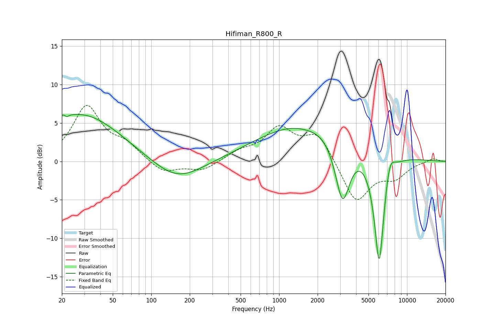

# Hifiman_R800_R
See [usage instructions](https://github.com/jaakkopasanen/AutoEq#usage) for more options and info.

### Parametric EQs
Apply preamp of -6.2 dB when using parametric equalizer.

|   # | Type    |   Fc (Hz) |    Q |   Gain (dB) |
|-----|---------|-----------|------|-------------|
|   1 | Peaking |        21 | 5.17 |         3.2 |
|   2 | Peaking |        21 | 5.94 |        -2.9 |
|   3 | Peaking |        27 | 0.6  |         0.3 |
|   4 | Peaking |        29 | 0.46 |         5.8 |
|   5 | Peaking |       159 | 0.73 |        -2.8 |
|   6 | Peaking |      1670 | 1.31 |        -0.5 |
|   7 | Peaking |      1964 | 0.33 |         5.7 |
|   8 | Peaking |      3132 | 2.31 |        -8.9 |
|   9 | Peaking |      6062 | 3.24 |       -15.6 |
|  10 | Peaking |      7328 | 3.61 |         2.9 |

### Fixed Band EQs
When using fixed band (also called graphic) equalizer, apply preamp of **-7.4 dB** (if available) and set gains manually with these parameters.

|   # | Type    |   Fc (Hz) |    Q |   Gain (dB) |
|-----|---------|-----------|------|-------------|
|   1 | Peaking |        31 | 1.41 |         7   |
|   2 | Peaking |        62 | 1.41 |         1.9 |
|   3 | Peaking |       125 | 1.41 |        -1.6 |
|   4 | Peaking |       250 | 1.41 |        -1.2 |
|   5 | Peaking |       500 | 1.41 |         1.1 |
|   6 | Peaking |      1000 | 1.41 |         4   |
|   7 | Peaking |      2000 | 1.41 |         3.6 |
|   8 | Peaking |      4000 | 1.41 |        -5.4 |
|   9 | Peaking |      8000 | 1.41 |        -1.9 |
|  10 | Peaking |     16000 | 1.41 |         0.5 |

### Graphs

