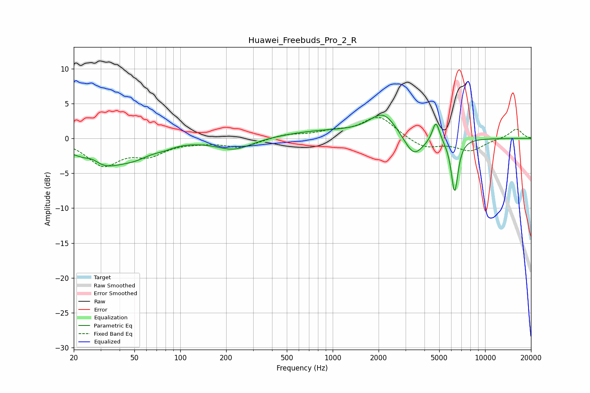

# Huawei_Freebuds_Pro_2_R
See [usage instructions](https://github.com/jaakkopasanen/AutoEq#usage) for more options and info.

### Parametric EQs
Apply preamp of -3.4 dB when using parametric equalizer.

|   # | Type    |   Fc (Hz) |    Q |   Gain (dB) |
|-----|---------|-----------|------|-------------|
|   1 | Peaking |        27 | 2.91 |         0.9 |
|   2 | Peaking |        30 | 0.91 |        -3.8 |
|   3 | Peaking |        51 | 1.38 |        -1.3 |
|   4 | Peaking |        78 | 2.25 |        -0.5 |
|   5 | Peaking |       226 | 1.2  |        -1.6 |
|   6 | Peaking |       859 | 0.51 |         1   |
|   7 | Peaking |      2148 | 1.57 |         3.4 |
|   8 | Peaking |      3398 | 2.23 |        -3.2 |
|   9 | Peaking |      4757 | 5.84 |         3   |
|  10 | Peaking |      6310 | 6    |        -7.7 |

### Fixed Band EQs
When using fixed band (also called graphic) equalizer, apply preamp of **-3.1 dB** (if available) and set gains manually with these parameters.

|   # | Type    |   Fc (Hz) |    Q |   Gain (dB) |
|-----|---------|-----------|------|-------------|
|   1 | Peaking |        31 | 1.41 |        -3.7 |
|   2 | Peaking |        62 | 1.41 |        -2   |
|   3 | Peaking |       125 | 1.41 |        -0.3 |
|   4 | Peaking |       250 | 1.41 |        -1.3 |
|   5 | Peaking |       500 | 1.41 |         0.6 |
|   6 | Peaking |      1000 | 1.41 |         0.8 |
|   7 | Peaking |      2000 | 1.41 |         3.2 |
|   8 | Peaking |      4000 | 1.41 |        -1.5 |
|   9 | Peaking |      8000 | 1.41 |        -1.7 |
|  10 | Peaking |     16000 | 1.41 |         1.4 |

### Graphs

