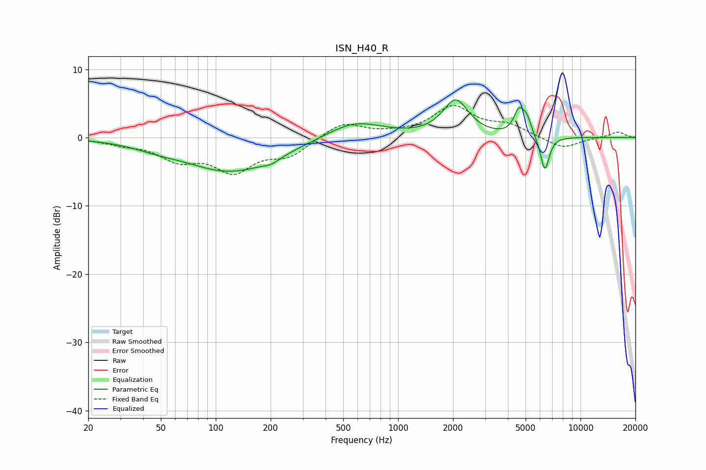

# ISN_H40_R
See [usage instructions](https://github.com/jaakkopasanen/AutoEq#usage) for more options and info.

### Parametric EQs
Apply preamp of -5.6 dB when using parametric equalizer.

|   # | Type    |   Fc (Hz) |    Q |   Gain (dB) |
|-----|---------|-----------|------|-------------|
|   1 | Peaking |        47 | 1.24 |        -0.6 |
|   2 | Peaking |       121 | 0.55 |        -4.9 |
|   3 | Peaking |       202 | 3.01 |        -0.7 |
|   4 | Peaking |       575 | 0.92 |         2.5 |
|   5 | Peaking |      2070 | 2.03 |         5.3 |
|   6 | Peaking |      4597 | 4.92 |         3.9 |
|   7 | Peaking |      4780 | 4.12 |        -1   |
|   8 | Peaking |      4903 | 6    |         1.1 |
|   9 | Peaking |      5136 | 5.97 |         1.8 |
|  10 | Peaking |      6378 | 5.79 |        -5.1 |

### Fixed Band EQs
When using fixed band (also called graphic) equalizer, apply preamp of **-4.8 dB** (if available) and set gains manually with these parameters.

|   # | Type    |   Fc (Hz) |    Q |   Gain (dB) |
|-----|---------|-----------|------|-------------|
|   1 | Peaking |        31 | 1.41 |        -0.7 |
|   2 | Peaking |        62 | 1.41 |        -2.9 |
|   3 | Peaking |       125 | 1.41 |        -4.5 |
|   4 | Peaking |       250 | 1.41 |        -2.4 |
|   5 | Peaking |       500 | 1.41 |         2.3 |
|   6 | Peaking |      1000 | 1.41 |         0.3 |
|   7 | Peaking |      2000 | 1.41 |         4.4 |
|   8 | Peaking |      4000 | 1.41 |         1.6 |
|   9 | Peaking |      8000 | 1.41 |        -1.7 |
|  10 | Peaking |     16000 | 1.41 |         0.8 |

### Graphs

