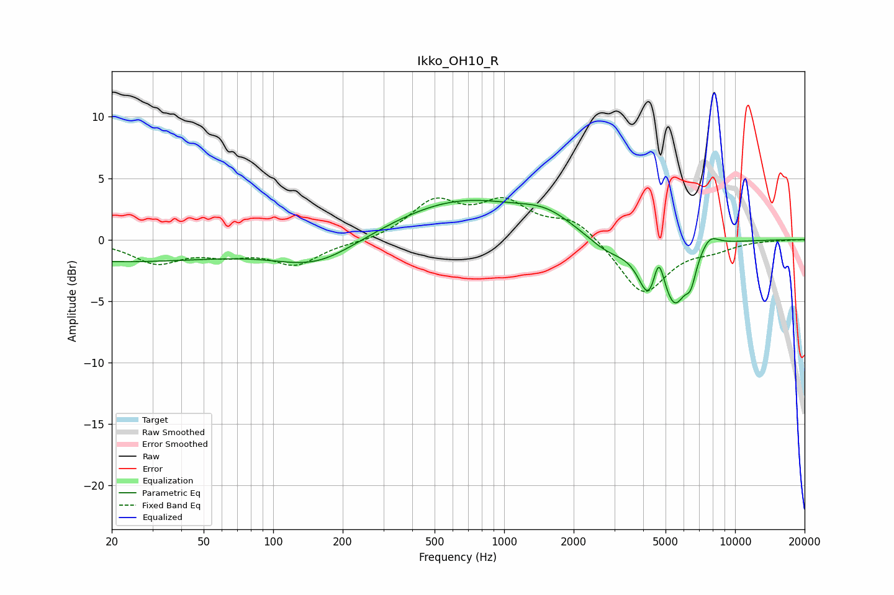

# Ikko_OH10_R
See [usage instructions](https://github.com/jaakkopasanen/AutoEq#usage) for more options and info.

### Parametric EQs
Apply preamp of -3.3 dB when using parametric equalizer.

|   # | Type    |   Fc (Hz) |    Q |   Gain (dB) |
|-----|---------|-----------|------|-------------|
|   1 | Peaking |        20 | 0.26 |        -1.7 |
|   2 | Peaking |       155 | 0.79 |        -2.1 |
|   3 | Peaking |       648 | 0.48 |         3.2 |
|   4 | Peaking |      1523 | 1.22 |         1.2 |
|   5 | Peaking |      2803 | 1.52 |        -1.3 |
|   6 | Peaking |      4239 | 3.07 |        -3.8 |
|   7 | Peaking |      4666 | 6    |         2.9 |
|   8 | Peaking |      5487 | 2.63 |        -4.6 |
|   9 | Peaking |      6432 | 5.87 |        -1.8 |
|  10 | Peaking |      7753 | 3.27 |         1.1 |

### Fixed Band EQs
When using fixed band (also called graphic) equalizer, apply preamp of **-3.5 dB** (if available) and set gains manually with these parameters.

|   # | Type    |   Fc (Hz) |    Q |   Gain (dB) |
|-----|---------|-----------|------|-------------|
|   1 | Peaking |        31 | 1.41 |        -1.8 |
|   2 | Peaking |        62 | 1.41 |        -0.9 |
|   3 | Peaking |       125 | 1.41 |        -1.9 |
|   4 | Peaking |       250 | 1.41 |        -0.2 |
|   5 | Peaking |       500 | 1.41 |         3   |
|   6 | Peaking |      1000 | 1.41 |         2.7 |
|   7 | Peaking |      2000 | 1.41 |         1.7 |
|   8 | Peaking |      4000 | 1.41 |        -4.5 |
|   9 | Peaking |      8000 | 1.41 |        -0.6 |
|  10 | Peaking |     16000 | 1.41 |        -0   |

### Graphs

