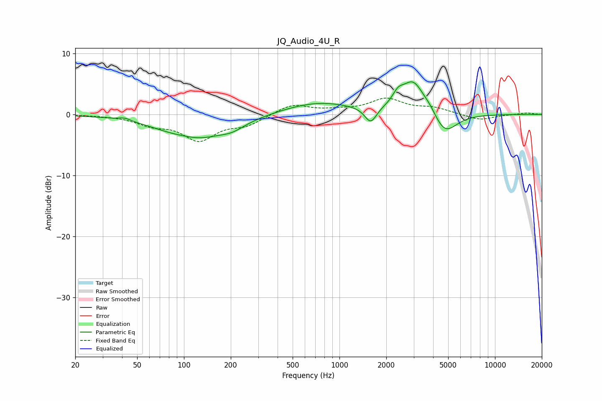

# JQ_Audio_4U_R
See [usage instructions](https://github.com/jaakkopasanen/AutoEq#usage) for more options and info.

### Parametric EQs
Apply preamp of -5.4 dB when using parametric equalizer.

|   # | Type    |   Fc (Hz) |    Q |   Gain (dB) |
|-----|---------|-----------|------|-------------|
|   1 | Peaking |        42 | 3.62 |         0.5 |
|   2 | Peaking |       101 | 1.74 |         0.3 |
|   3 | Peaking |       117 | 0.67 |        -4   |
|   4 | Peaking |       206 | 1.87 |        -0.9 |
|   5 | Peaking |       724 | 0.62 |         2   |
|   6 | Peaking |      1588 | 3.73 |        -2.7 |
|   7 | Peaking |      2380 | 4.05 |         1.6 |
|   8 | Peaking |      2977 | 1.91 |         5.4 |
|   9 | Peaking |      3823 | 3.24 |         0.9 |
|  10 | Peaking |      4746 | 1.83 |        -3.8 |

### Fixed Band EQs
When using fixed band (also called graphic) equalizer, apply preamp of **-2.8 dB** (if available) and set gains manually with these parameters.

|   # | Type    |   Fc (Hz) |    Q |   Gain (dB) |
|-----|---------|-----------|------|-------------|
|   1 | Peaking |        31 | 1.41 |        -0.1 |
|   2 | Peaking |        62 | 1.41 |        -1.4 |
|   3 | Peaking |       125 | 1.41 |        -4   |
|   4 | Peaking |       250 | 1.41 |        -1.6 |
|   5 | Peaking |       500 | 1.41 |         1.7 |
|   6 | Peaking |      1000 | 1.41 |         0.5 |
|   7 | Peaking |      2000 | 1.41 |         2.4 |
|   8 | Peaking |      4000 | 1.41 |         0.9 |
|   9 | Peaking |      8000 | 1.41 |        -1   |
|  10 | Peaking |     16000 | 1.41 |         0.3 |

### Graphs

