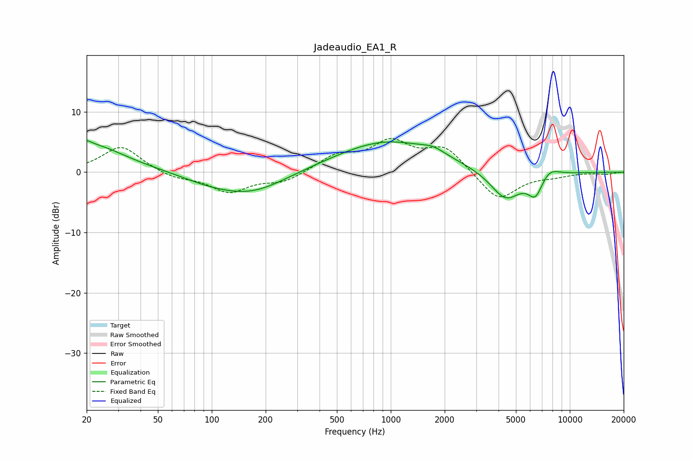

# Jadeaudio_EA1_R
See [usage instructions](https://github.com/jaakkopasanen/AutoEq#usage) for more options and info.

### Parametric EQs
Apply preamp of -5.3 dB when using parametric equalizer.

|   # | Type    |   Fc (Hz) |    Q |   Gain (dB) |
|-----|---------|-----------|------|-------------|
|   1 | Peaking |        20 | 5.94 |         0.6 |
|   2 | Peaking |        20 | 0.72 |         4.7 |
|   3 | Peaking |        93 | 0.98 |        -0.9 |
|   4 | Peaking |       164 | 0.72 |        -3.5 |
|   5 | Peaking |       498 | 0.71 |         0.1 |
|   6 | Peaking |       964 | 0.5  |         5.1 |
|   7 | Peaking |      1724 | 2.21 |         1   |
|   8 | Peaking |      4379 | 1.61 |        -4.9 |
|   9 | Peaking |      6423 | 3.33 |        -3.4 |
|  10 | Peaking |      7689 | 2.57 |         1.4 |

### Fixed Band EQs
When using fixed band (also called graphic) equalizer, apply preamp of **-5.7 dB** (if available) and set gains manually with these parameters.

|   # | Type    |   Fc (Hz) |    Q |   Gain (dB) |
|-----|---------|-----------|------|-------------|
|   1 | Peaking |        31 | 1.41 |         4.4 |
|   2 | Peaking |        62 | 1.41 |        -1   |
|   3 | Peaking |       125 | 1.41 |        -3.2 |
|   4 | Peaking |       250 | 1.41 |        -1.6 |
|   5 | Peaking |       500 | 1.41 |         2.5 |
|   6 | Peaking |      1000 | 1.41 |         4.6 |
|   7 | Peaking |      2000 | 1.41 |         4   |
|   8 | Peaking |      4000 | 1.41 |        -4.8 |
|   9 | Peaking |      8000 | 1.41 |        -0.5 |
|  10 | Peaking |     16000 | 1.41 |        -0.3 |

### Graphs

