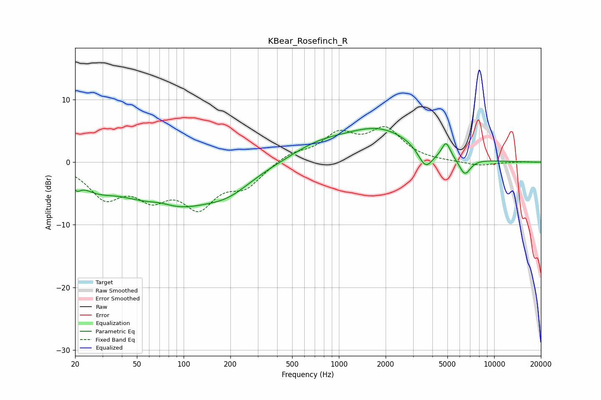

# KBear_Rosefinch_R
See [usage instructions](https://github.com/jaakkopasanen/AutoEq#usage) for more options and info.

### Parametric EQs
Apply preamp of -5.5 dB when using parametric equalizer.

|   # | Type    |   Fc (Hz) |    Q |   Gain (dB) |
|-----|---------|-----------|------|-------------|
|   1 | Peaking |        20 | 5.13 |        -1.5 |
|   2 | Peaking |        27 | 1.33 |        -2   |
|   3 | Peaking |        71 | 1.62 |         1   |
|   4 | Peaking |        81 | 0.46 |        -7.1 |
|   5 | Peaking |       195 | 0.96 |        -2.2 |
|   6 | Peaking |       720 | 0.8  |         1.9 |
|   7 | Peaking |      1817 | 0.58 |         5.1 |
|   8 | Peaking |      3614 | 2.87 |        -3.4 |
|   9 | Peaking |      4902 | 5.23 |         2.4 |
|  10 | Peaking |      6469 | 3.59 |        -2.8 |

### Fixed Band EQs
When using fixed band (also called graphic) equalizer, apply preamp of **-5.8 dB** (if available) and set gains manually with these parameters.

|   # | Type    |   Fc (Hz) |    Q |   Gain (dB) |
|-----|---------|-----------|------|-------------|
|   1 | Peaking |        31 | 1.41 |        -5.2 |
|   2 | Peaking |        62 | 1.41 |        -4.6 |
|   3 | Peaking |       125 | 1.41 |        -6.3 |
|   4 | Peaking |       250 | 1.41 |        -3.4 |
|   5 | Peaking |       500 | 1.41 |         1.4 |
|   6 | Peaking |      1000 | 1.41 |         4.1 |
|   7 | Peaking |      2000 | 1.41 |         4.9 |
|   8 | Peaking |      4000 | 1.41 |         0   |
|   9 | Peaking |      8000 | 1.41 |        -0.6 |
|  10 | Peaking |     16000 | 1.41 |         0.1 |

### Graphs

