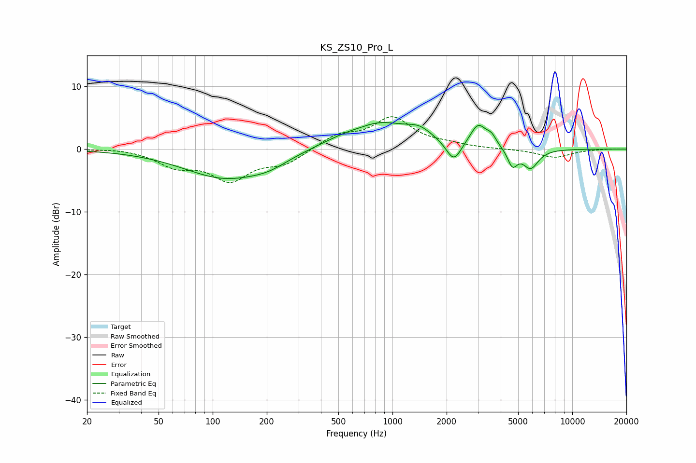

# KS_ZS10_Pro_L
See [usage instructions](https://github.com/jaakkopasanen/AutoEq#usage) for more options and info.

### Parametric EQs
Apply preamp of -4.3 dB when using parametric equalizer.

|   # | Type    |   Fc (Hz) |    Q |   Gain (dB) |
|-----|---------|-----------|------|-------------|
|   1 | Peaking |       117 | 0.61 |        -4.5 |
|   2 | Peaking |       206 | 1.3  |        -1.2 |
|   3 | Peaking |       669 | 2.33 |        -0.4 |
|   4 | Peaking |       798 | 0.71 |         4.5 |
|   5 | Peaking |      1415 | 2.03 |         1.5 |
|   6 | Peaking |      2192 | 3.35 |        -3.4 |
|   7 | Peaking |      2999 | 3.13 |         3.6 |
|   8 | Peaking |      3555 | 5.25 |         1.3 |
|   9 | Peaking |      4648 | 5.24 |        -2.7 |
|  10 | Peaking |      5864 | 3.18 |        -3.1 |

### Fixed Band EQs
When using fixed band (also called graphic) equalizer, apply preamp of **-5.3 dB** (if available) and set gains manually with these parameters.

|   # | Type    |   Fc (Hz) |    Q |   Gain (dB) |
|-----|---------|-----------|------|-------------|
|   1 | Peaking |        31 | 1.41 |         0.2 |
|   2 | Peaking |        62 | 1.41 |        -2.4 |
|   3 | Peaking |       125 | 1.41 |        -4.6 |
|   4 | Peaking |       250 | 1.41 |        -2.1 |
|   5 | Peaking |       500 | 1.41 |         2.1 |
|   6 | Peaking |      1000 | 1.41 |         4.8 |
|   7 | Peaking |      2000 | 1.41 |         0.5 |
|   8 | Peaking |      4000 | 1.41 |        -0   |
|   9 | Peaking |      8000 | 1.41 |        -1.3 |
|  10 | Peaking |     16000 | 1.41 |         0   |

### Graphs

