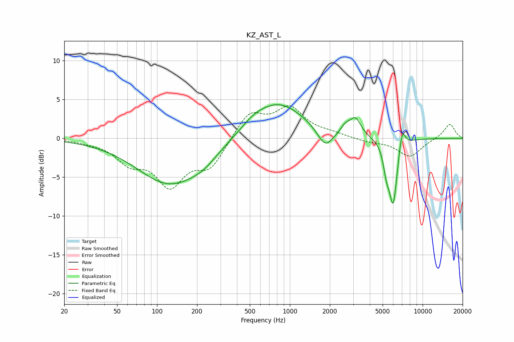

# KZ_AST_L
See [usage instructions](https://github.com/jaakkopasanen/AutoEq#usage) for more options and info.

### Parametric EQs
Apply preamp of -4.4 dB when using parametric equalizer.

|   # | Type    |   Fc (Hz) |    Q |   Gain (dB) |
|-----|---------|-----------|------|-------------|
|   1 | Peaking |       124 | 0.58 |        -5.8 |
|   2 | Peaking |       221 | 1.34 |        -1.1 |
|   3 | Peaking |       528 | 1.74 |         0.7 |
|   4 | Peaking |       807 | 0.7  |         4.7 |
|   5 | Peaking |      1847 | 2.41 |        -2.5 |
|   6 | Peaking |      2610 | 4.07 |         1   |
|   7 | Peaking |      3114 | 3.34 |         2.2 |
|   8 | Peaking |      5343 | 6    |        -2.6 |
|   9 | Peaking |      6003 | 4.52 |        -8.3 |
|  10 | Peaking |      7014 | 5.81 |         2.7 |

### Fixed Band EQs
When using fixed band (also called graphic) equalizer, apply preamp of **-4.3 dB** (if available) and set gains manually with these parameters.

|   # | Type    |   Fc (Hz) |    Q |   Gain (dB) |
|-----|---------|-----------|------|-------------|
|   1 | Peaking |        31 | 1.41 |        -0.2 |
|   2 | Peaking |        62 | 1.41 |        -2.7 |
|   3 | Peaking |       125 | 1.41 |        -5.6 |
|   4 | Peaking |       250 | 1.41 |        -3.5 |
|   5 | Peaking |       500 | 1.41 |         3.3 |
|   6 | Peaking |      1000 | 1.41 |         3.7 |
|   7 | Peaking |      2000 | 1.41 |         0.5 |
|   8 | Peaking |      4000 | 1.41 |        -0.4 |
|   9 | Peaking |      8000 | 1.41 |        -2.4 |
|  10 | Peaking |     16000 | 1.41 |         1.9 |

### Graphs

