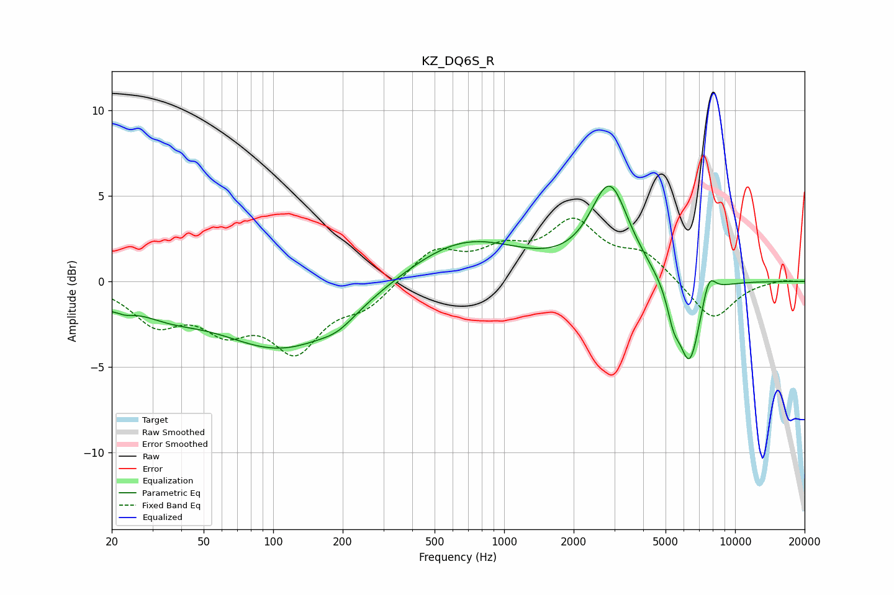

# KZ_DQ6S_R
See [usage instructions](https://github.com/jaakkopasanen/AutoEq#usage) for more options and info.

### Parametric EQs
Apply preamp of -5.7 dB when using parametric equalizer.

|   # | Type    |   Fc (Hz) |    Q |   Gain (dB) |
|-----|---------|-----------|------|-------------|
|   1 | Peaking |        21 | 2.87 |        -1.6 |
|   2 | Peaking |        21 | 4.28 |         0.8 |
|   3 | Peaking |        35 | 0.96 |        -1.1 |
|   4 | Peaking |       110 | 0.51 |        -3.9 |
|   5 | Peaking |       191 | 1.9  |        -0.6 |
|   6 | Peaking |       672 | 0.57 |         2.6 |
|   7 | Peaking |      2865 | 1.71 |         5.4 |
|   8 | Peaking |      5411 | 4.82 |        -1.6 |
|   9 | Peaking |      6352 | 2.92 |        -4.9 |
|  10 | Peaking |      7700 | 4.65 |         1.4 |

### Fixed Band EQs
When using fixed band (also called graphic) equalizer, apply preamp of **-3.8 dB** (if available) and set gains manually with these parameters.

|   # | Type    |   Fc (Hz) |    Q |   Gain (dB) |
|-----|---------|-----------|------|-------------|
|   1 | Peaking |        31 | 1.41 |        -2.2 |
|   2 | Peaking |        62 | 1.41 |        -2.3 |
|   3 | Peaking |       125 | 1.41 |        -3.7 |
|   4 | Peaking |       250 | 1.41 |        -1.3 |
|   5 | Peaking |       500 | 1.41 |         1.8 |
|   6 | Peaking |      1000 | 1.41 |         1.5 |
|   7 | Peaking |      2000 | 1.41 |         3.2 |
|   8 | Peaking |      4000 | 1.41 |         1.5 |
|   9 | Peaking |      8000 | 1.41 |        -2.3 |
|  10 | Peaking |     16000 | 1.41 |         0.1 |

### Graphs

