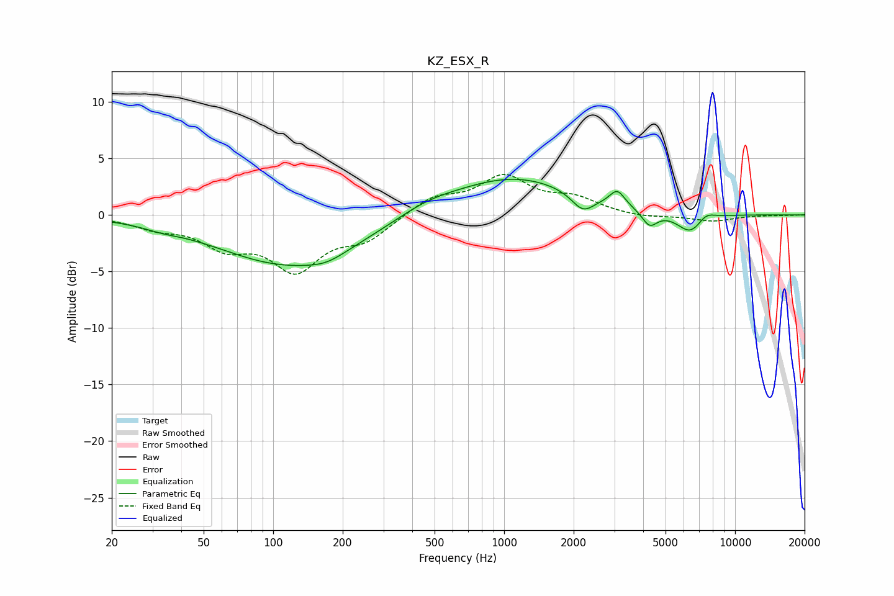

# KZ_ESX_R
See [usage instructions](https://github.com/jaakkopasanen/AutoEq#usage) for more options and info.

### Parametric EQs
Apply preamp of -3.2 dB when using parametric equalizer.

|   # | Type    |   Fc (Hz) |    Q |   Gain (dB) |
|-----|---------|-----------|------|-------------|
|   1 | Peaking |        33 | 1.86 |        -0.3 |
|   2 | Peaking |       118 | 0.46 |        -4.4 |
|   3 | Peaking |       170 | 1.71 |        -0.6 |
|   4 | Peaking |       458 | 1.12 |         0.7 |
|   5 | Peaking |      1096 | 0.51 |         3.4 |
|   6 | Peaking |      2194 | 2.88 |        -1.6 |
|   7 | Peaking |      3088 | 4.42 |         1.3 |
|   8 | Peaking |      4262 | 4.17 |        -1.4 |
|   9 | Peaking |      6409 | 2.37 |        -1.8 |
|  10 | Peaking |      7464 | 3.5  |         0.7 |

### Fixed Band EQs
When using fixed band (also called graphic) equalizer, apply preamp of **-3.7 dB** (if available) and set gains manually with these parameters.

|   # | Type    |   Fc (Hz) |    Q |   Gain (dB) |
|-----|---------|-----------|------|-------------|
|   1 | Peaking |        31 | 1.41 |        -0.9 |
|   2 | Peaking |        62 | 1.41 |        -2.4 |
|   3 | Peaking |       125 | 1.41 |        -4.5 |
|   4 | Peaking |       250 | 1.41 |        -1.9 |
|   5 | Peaking |       500 | 1.41 |         1.5 |
|   6 | Peaking |      1000 | 1.41 |         3.2 |
|   7 | Peaking |      2000 | 1.41 |         1.3 |
|   8 | Peaking |      4000 | 1.41 |        -0.3 |
|   9 | Peaking |      8000 | 1.41 |        -0.6 |
|  10 | Peaking |     16000 | 1.41 |        -0   |

### Graphs

