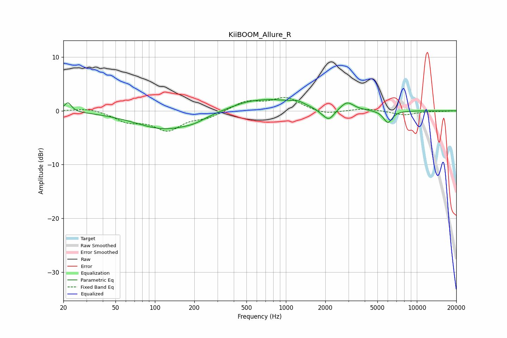

# KiiBOOM_Allure_R
See [usage instructions](https://github.com/jaakkopasanen/AutoEq#usage) for more options and info.

### Parametric EQs
Apply preamp of -2.2 dB when using parametric equalizer.

|   # | Type    |   Fc (Hz) |    Q |   Gain (dB) |
|-----|---------|-----------|------|-------------|
|   1 | Peaking |        22 | 5.3  |         1.8 |
|   2 | Peaking |       121 | 0.61 |        -3.5 |
|   3 | Peaking |       200 | 1.83 |        -0.5 |
|   4 | Peaking |       489 | 1.8  |         0.2 |
|   5 | Peaking |       703 | 0.54 |         2.3 |
|   6 | Peaking |      1225 | 3.39 |         0.5 |
|   7 | Peaking |      1856 | 2.65 |        -0.5 |
|   8 | Peaking |      2132 | 3.35 |        -2.1 |
|   9 | Peaking |      2933 | 2.95 |         1.5 |
|  10 | Peaking |      6006 | 4.08 |        -2.3 |

### Fixed Band EQs
When using fixed band (also called graphic) equalizer, apply preamp of **-2.6 dB** (if available) and set gains manually with these parameters.

|   # | Type    |   Fc (Hz) |    Q |   Gain (dB) |
|-----|---------|-----------|------|-------------|
|   1 | Peaking |        31 | 1.41 |         0.6 |
|   2 | Peaking |        62 | 1.41 |        -1.8 |
|   3 | Peaking |       125 | 1.41 |        -3.4 |
|   4 | Peaking |       250 | 1.41 |        -1.1 |
|   5 | Peaking |       500 | 1.41 |         1.7 |
|   6 | Peaking |      1000 | 1.41 |         2.3 |
|   7 | Peaking |      2000 | 1.41 |        -0.8 |
|   8 | Peaking |      4000 | 1.41 |         0.4 |
|   9 | Peaking |      8000 | 1.41 |        -0.8 |
|  10 | Peaking |     16000 | 1.41 |        -0.1 |

### Graphs

