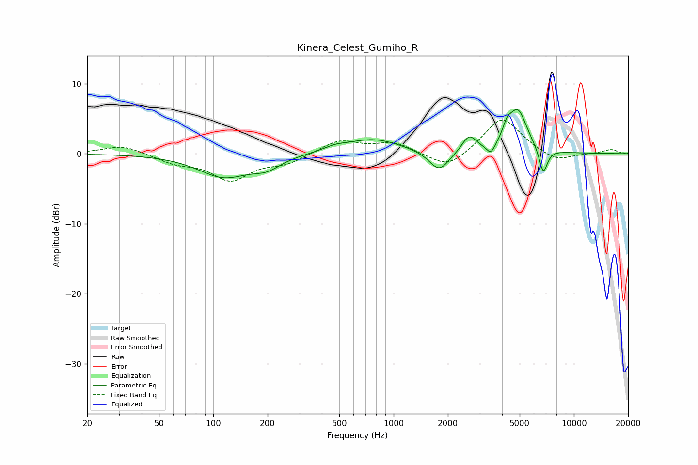

# Kinera_Celest_Gumiho_R
See [usage instructions](https://github.com/jaakkopasanen/AutoEq#usage) for more options and info.

### Parametric EQs
Apply preamp of -6.4 dB when using parametric equalizer.

|   # | Type    |   Fc (Hz) |    Q |   Gain (dB) |
|-----|---------|-----------|------|-------------|
|   1 | Peaking |       115 | 1    |        -3.3 |
|   2 | Peaking |       198 | 1.84 |        -1.4 |
|   3 | Peaking |       473 | 2.29 |         0.5 |
|   4 | Peaking |       769 | 0.91 |         2.1 |
|   5 | Peaking |      1789 | 2.56 |        -2.9 |
|   6 | Peaking |      2627 | 3.6  |         2.4 |
|   7 | Peaking |      3464 | 5.97 |        -1.5 |
|   8 | Peaking |      4255 | 5.99 |         1.7 |
|   9 | Peaking |      4880 | 2.67 |         6   |
|  10 | Peaking |      6758 | 5.84 |        -3.7 |

### Fixed Band EQs
When using fixed band (also called graphic) equalizer, apply preamp of **-4.9 dB** (if available) and set gains manually with these parameters.

|   # | Type    |   Fc (Hz) |    Q |   Gain (dB) |
|-----|---------|-----------|------|-------------|
|   1 | Peaking |        31 | 1.41 |         1.2 |
|   2 | Peaking |        62 | 1.41 |        -1.2 |
|   3 | Peaking |       125 | 1.41 |        -3.6 |
|   4 | Peaking |       250 | 1.41 |        -1.3 |
|   5 | Peaking |       500 | 1.41 |         1.9 |
|   6 | Peaking |      1000 | 1.41 |         1.5 |
|   7 | Peaking |      2000 | 1.41 |        -2.4 |
|   8 | Peaking |      4000 | 1.41 |         5.3 |
|   9 | Peaking |      8000 | 1.41 |        -1.3 |
|  10 | Peaking |     16000 | 1.41 |         0.6 |

### Graphs

