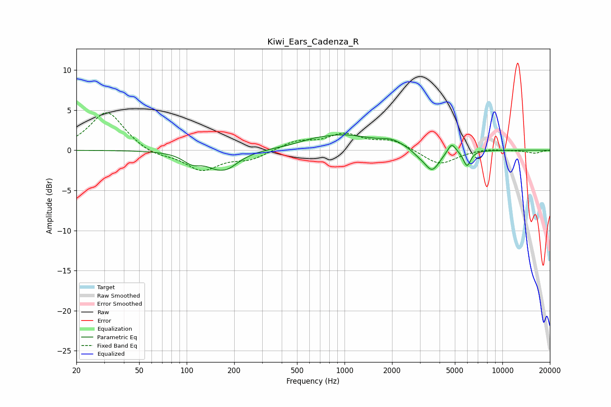

# Kiwi_Ears_Cadenza_R
See [usage instructions](https://github.com/jaakkopasanen/AutoEq#usage) for more options and info.

### Parametric EQs
Apply preamp of -2.0 dB when using parametric equalizer.

|   # | Type    |   Fc (Hz) |    Q |   Gain (dB) |
|-----|---------|-----------|------|-------------|
|   1 | Peaking |       108 | 2.43 |        -1.2 |
|   2 | Peaking |       168 | 3.65 |         0.3 |
|   3 | Peaking |       169 | 1.69 |        -2.7 |
|   4 | Peaking |       615 | 2.01 |         0.2 |
|   5 | Peaking |       961 | 0.69 |         1.9 |
|   6 | Peaking |      2005 | 1.99 |         0.7 |
|   7 | Peaking |      2946 | 3.47 |        -0.4 |
|   8 | Peaking |      3584 | 2.89 |        -2.7 |
|   9 | Peaking |      4773 | 5.49 |         1.3 |
|  10 | Peaking |      5971 | 6    |        -1.9 |

### Fixed Band EQs
When using fixed band (also called graphic) equalizer, apply preamp of **-4.8 dB** (if available) and set gains manually with these parameters.

|   # | Type    |   Fc (Hz) |    Q |   Gain (dB) |
|-----|---------|-----------|------|-------------|
|   1 | Peaking |        31 | 1.41 |         4.9 |
|   2 | Peaking |        62 | 1.41 |        -0.7 |
|   3 | Peaking |       125 | 1.41 |        -2.4 |
|   4 | Peaking |       250 | 1.41 |        -1.1 |
|   5 | Peaking |       500 | 1.41 |         1.1 |
|   6 | Peaking |      1000 | 1.41 |         1.8 |
|   7 | Peaking |      2000 | 1.41 |         1.2 |
|   8 | Peaking |      4000 | 1.41 |        -1.9 |
|   9 | Peaking |      8000 | 1.41 |         0.2 |
|  10 | Peaking |     16000 | 1.41 |        -0.4 |

### Graphs

