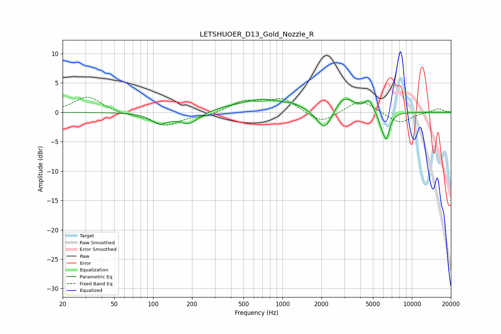

# LETSHUOER_D13_Gold_Nozzle_R
See [usage instructions](https://github.com/jaakkopasanen/AutoEq#usage) for more options and info.

### Parametric EQs
Apply preamp of -2.4 dB when using parametric equalizer.

|   # | Type    |   Fc (Hz) |    Q |   Gain (dB) |
|-----|---------|-----------|------|-------------|
|   1 | Peaking |       112 | 2.26 |        -1.7 |
|   2 | Peaking |       189 | 1.82 |        -2.1 |
|   3 | Peaking |       383 | 0.8  |         0.5 |
|   4 | Peaking |       728 | 0.82 |         2   |
|   5 | Peaking |      1239 | 2.01 |         0.5 |
|   6 | Peaking |      2115 | 2.5  |        -3.8 |
|   7 | Peaking |      3008 | 1.88 |         2.8 |
|   8 | Peaking |      4660 | 4.36 |         1.8 |
|   9 | Peaking |      5759 | 5.99 |        -1.2 |
|  10 | Peaking |      6325 | 5.06 |        -4.5 |

### Fixed Band EQs
When using fixed band (also called graphic) equalizer, apply preamp of **-2.7 dB** (if available) and set gains manually with these parameters.

|   # | Type    |   Fc (Hz) |    Q |   Gain (dB) |
|-----|---------|-----------|------|-------------|
|   1 | Peaking |        31 | 1.41 |         2.7 |
|   2 | Peaking |        62 | 1.41 |        -0.4 |
|   3 | Peaking |       125 | 1.41 |        -2.2 |
|   4 | Peaking |       250 | 1.41 |        -0.6 |
|   5 | Peaking |       500 | 1.41 |         1.8 |
|   6 | Peaking |      1000 | 1.41 |         2.3 |
|   7 | Peaking |      2000 | 1.41 |        -2   |
|   8 | Peaking |      4000 | 1.41 |         2.3 |
|   9 | Peaking |      8000 | 1.41 |        -1.9 |
|  10 | Peaking |     16000 | 1.41 |         0.7 |

### Graphs

