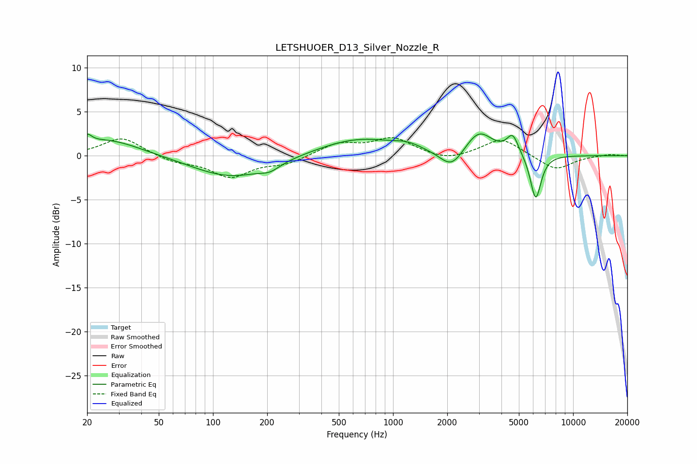

# LETSHUOER_D13_Silver_Nozzle_R
See [usage instructions](https://github.com/jaakkopasanen/AutoEq#usage) for more options and info.

### Parametric EQs
Apply preamp of -2.6 dB when using parametric equalizer.

|   # | Type    |   Fc (Hz) |    Q |   Gain (dB) |
|-----|---------|-----------|------|-------------|
|   1 | Peaking |        20 | 5.81 |         0.9 |
|   2 | Peaking |        26 | 0.76 |         1.9 |
|   3 | Peaking |       126 | 0.66 |        -2.5 |
|   4 | Peaking |       207 | 2.68 |        -0.7 |
|   5 | Peaking |       645 | 0.63 |         2   |
|   6 | Peaking |      1208 | 1.96 |         0.6 |
|   7 | Peaking |      2114 | 2.17 |        -2.2 |
|   8 | Peaking |      2997 | 1.88 |         2.8 |
|   9 | Peaking |      4620 | 4.31 |         2.2 |
|  10 | Peaking |      6199 | 4.59 |        -5.2 |

### Fixed Band EQs
When using fixed band (also called graphic) equalizer, apply preamp of **-2.1 dB** (if available) and set gains manually with these parameters.

|   # | Type    |   Fc (Hz) |    Q |   Gain (dB) |
|-----|---------|-----------|------|-------------|
|   1 | Peaking |        31 | 1.41 |         2.1 |
|   2 | Peaking |        62 | 1.41 |        -0.7 |
|   3 | Peaking |       125 | 1.41 |        -2.3 |
|   4 | Peaking |       250 | 1.41 |        -0.9 |
|   5 | Peaking |       500 | 1.41 |         1.4 |
|   6 | Peaking |      1000 | 1.41 |         1.9 |
|   7 | Peaking |      2000 | 1.41 |        -0.7 |
|   8 | Peaking |      4000 | 1.41 |         2   |
|   9 | Peaking |      8000 | 1.41 |        -1.7 |
|  10 | Peaking |     16000 | 1.41 |         0.2 |

### Graphs

