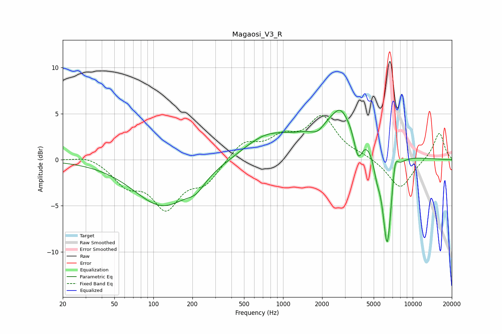

# Magaosi_V3_R
See [usage instructions](https://github.com/jaakkopasanen/AutoEq#usage) for more options and info.

### Parametric EQs
Apply preamp of -5.5 dB when using parametric equalizer.

|   # | Type    |   Fc (Hz) |    Q |   Gain (dB) |
|-----|---------|-----------|------|-------------|
|   1 | Peaking |       118 | 0.64 |        -5   |
|   2 | Peaking |       213 | 2.15 |        -1.1 |
|   3 | Peaking |       740 | 0.78 |         2.3 |
|   4 | Peaking |      1852 | 2.46 |        -1.1 |
|   5 | Peaking |      2748 | 3.3  |         0.8 |
|   6 | Peaking |      2874 | 0.65 |         5.2 |
|   7 | Peaking |      3789 | 4.07 |        -3.5 |
|   8 | Peaking |      5295 | 5.1  |        -1.8 |
|   9 | Peaking |      6356 | 3.74 |       -11.1 |
|  10 | Peaking |      7302 | 5.99 |         2.5 |

### Fixed Band EQs
When using fixed band (also called graphic) equalizer, apply preamp of **-4.9 dB** (if available) and set gains manually with these parameters.

|   # | Type    |   Fc (Hz) |    Q |   Gain (dB) |
|-----|---------|-----------|------|-------------|
|   1 | Peaking |        31 | 1.41 |         0.6 |
|   2 | Peaking |        62 | 1.41 |        -2.4 |
|   3 | Peaking |       125 | 1.41 |        -4.8 |
|   4 | Peaking |       250 | 1.41 |        -2.3 |
|   5 | Peaking |       500 | 1.41 |         1.9 |
|   6 | Peaking |      1000 | 1.41 |         2   |
|   7 | Peaking |      2000 | 1.41 |         4.4 |
|   8 | Peaking |      4000 | 1.41 |         0.3 |
|   9 | Peaking |      8000 | 1.41 |        -3.2 |
|  10 | Peaking |     16000 | 1.41 |         3   |

### Graphs

