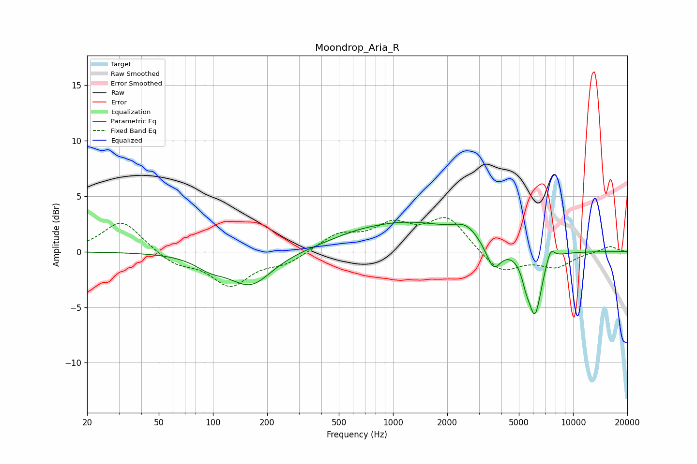

# Moondrop_Aria_R
See [usage instructions](https://github.com/jaakkopasanen/AutoEq#usage) for more options and info.

### Parametric EQs
Apply preamp of -2.8 dB when using parametric equalizer.

|   # | Type    |   Fc (Hz) |    Q |   Gain (dB) |
|-----|---------|-----------|------|-------------|
|   1 | Peaking |        97 | 1.67 |        -0.9 |
|   2 | Peaking |       162 | 1.2  |        -3   |
|   3 | Peaking |       600 | 0.86 |         0.5 |
|   4 | Peaking |      1249 | 0.49 |         2.5 |
|   5 | Peaking |      2546 | 2.05 |         1.2 |
|   6 | Peaking |      3588 | 3    |        -0.6 |
|   7 | Peaking |      3619 | 3.58 |        -1.7 |
|   8 | Peaking |      5469 | 6    |        -1.1 |
|   9 | Peaking |      6138 | 3.64 |        -5.7 |
|  10 | Peaking |      7488 | 5.7  |         1.2 |

### Fixed Band EQs
When using fixed band (also called graphic) equalizer, apply preamp of **-3.2 dB** (if available) and set gains manually with these parameters.

|   # | Type    |   Fc (Hz) |    Q |   Gain (dB) |
|-----|---------|-----------|------|-------------|
|   1 | Peaking |        31 | 1.41 |         2.9 |
|   2 | Peaking |        62 | 1.41 |        -1.1 |
|   3 | Peaking |       125 | 1.41 |        -2.9 |
|   4 | Peaking |       250 | 1.41 |        -1   |
|   5 | Peaking |       500 | 1.41 |         1.5 |
|   6 | Peaking |      1000 | 1.41 |         2.1 |
|   7 | Peaking |      2000 | 1.41 |         3   |
|   8 | Peaking |      4000 | 1.41 |        -2   |
|   9 | Peaking |      8000 | 1.41 |        -1.3 |
|  10 | Peaking |     16000 | 1.41 |         0.5 |

### Graphs

