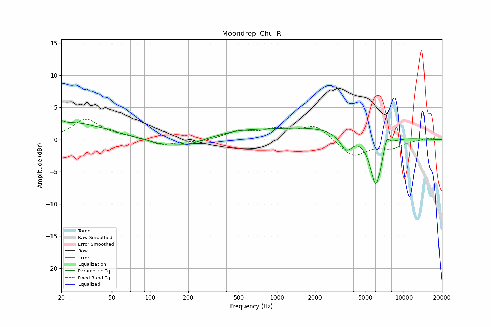

# Moondrop_Chu_R
See [usage instructions](https://github.com/jaakkopasanen/AutoEq#usage) for more options and info.

### Parametric EQs
Apply preamp of -3.0 dB when using parametric equalizer.

|   # | Type    |   Fc (Hz) |    Q |   Gain (dB) |
|-----|---------|-----------|------|-------------|
|   1 | Peaking |        20 | 5.99 |         0.6 |
|   2 | Peaking |        26 | 0.67 |         2.6 |
|   3 | Peaking |        48 | 3.6  |         0.2 |
|   4 | Peaking |       121 | 1.74 |        -0.7 |
|   5 | Peaking |       198 | 1.27 |        -1   |
|   6 | Peaking |       501 | 0.75 |         0.8 |
|   7 | Peaking |      2276 | 0.3  |         1.9 |
|   8 | Peaking |      3518 | 2.77 |        -2.7 |
|   9 | Peaking |      6049 | 2.85 |        -8.1 |
|  10 | Peaking |      7315 | 5.48 |         2.1 |

### Fixed Band EQs
When using fixed band (also called graphic) equalizer, apply preamp of **-3.3 dB** (if available) and set gains manually with these parameters.

|   # | Type    |   Fc (Hz) |    Q |   Gain (dB) |
|-----|---------|-----------|------|-------------|
|   1 | Peaking |        31 | 1.41 |         3.1 |
|   2 | Peaking |        62 | 1.41 |         0.5 |
|   3 | Peaking |       125 | 1.41 |        -0.9 |
|   4 | Peaking |       250 | 1.41 |        -0.3 |
|   5 | Peaking |       500 | 1.41 |         1.2 |
|   6 | Peaking |      1000 | 1.41 |         1.4 |
|   7 | Peaking |      2000 | 1.41 |         2.2 |
|   8 | Peaking |      4000 | 1.41 |        -2.7 |
|   9 | Peaking |      8000 | 1.41 |        -1.2 |
|  10 | Peaking |     16000 | 1.41 |         0.3 |

### Graphs

